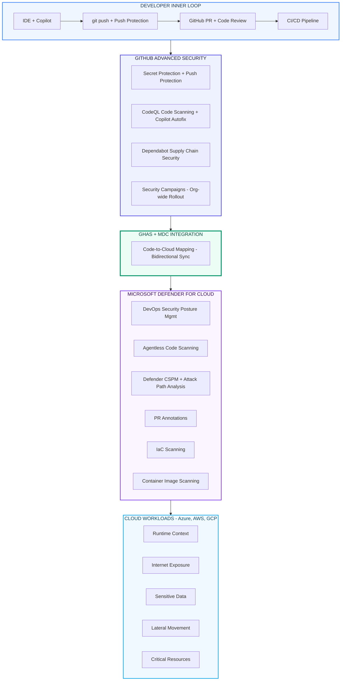
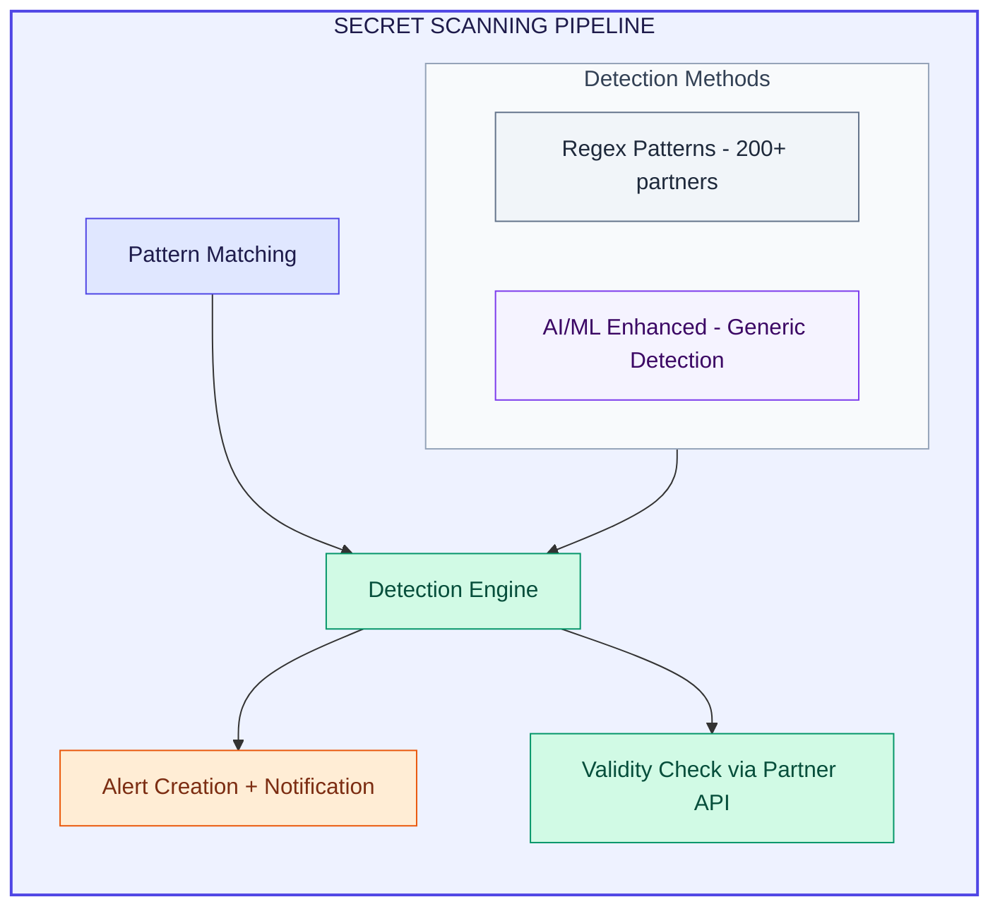
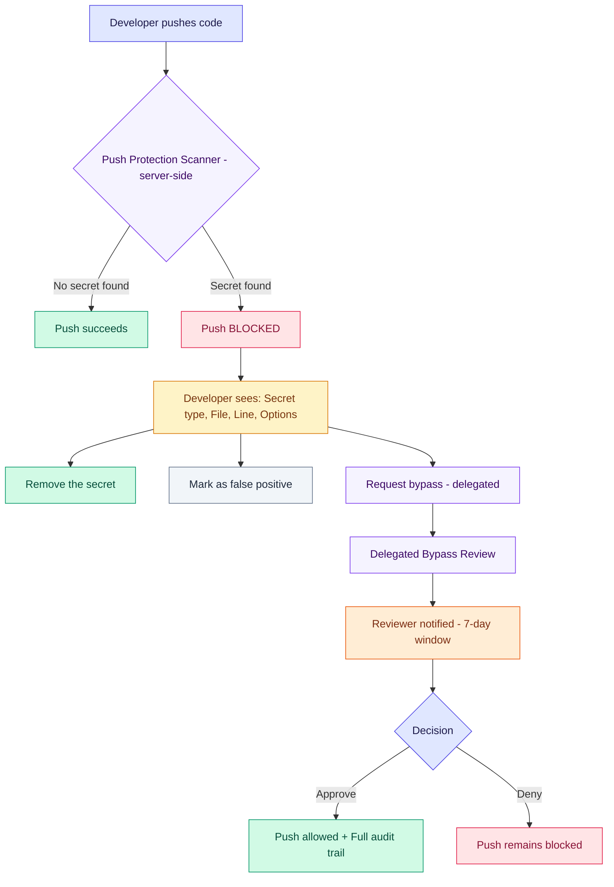
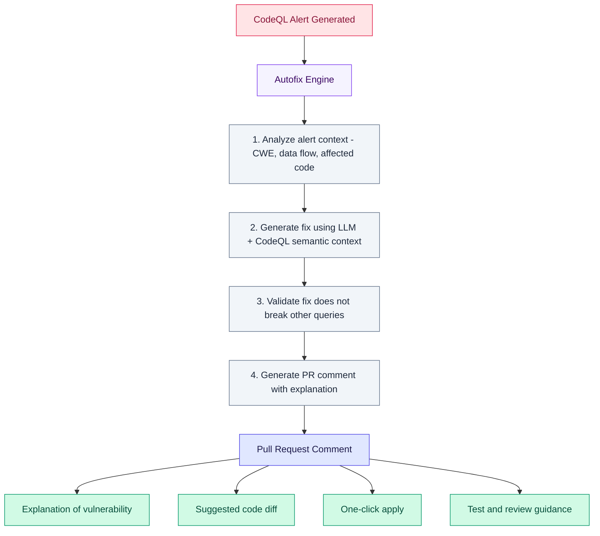
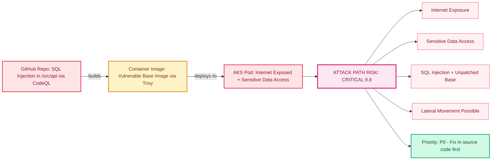
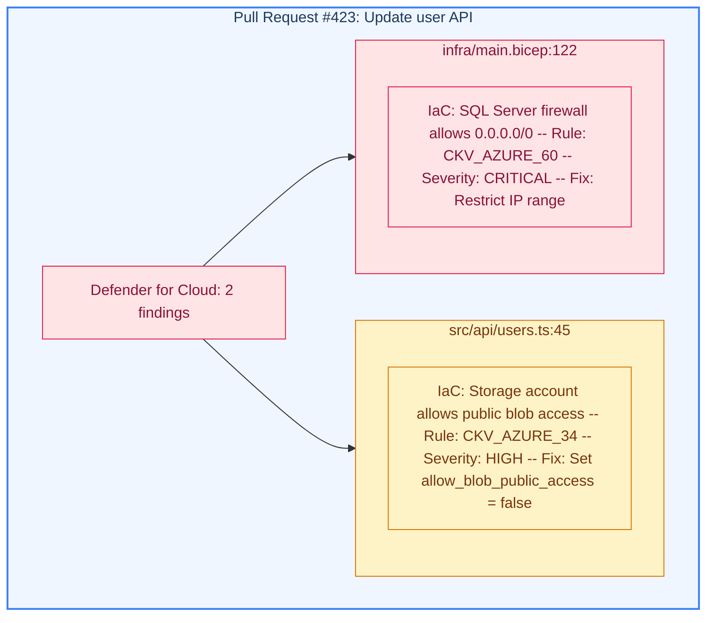
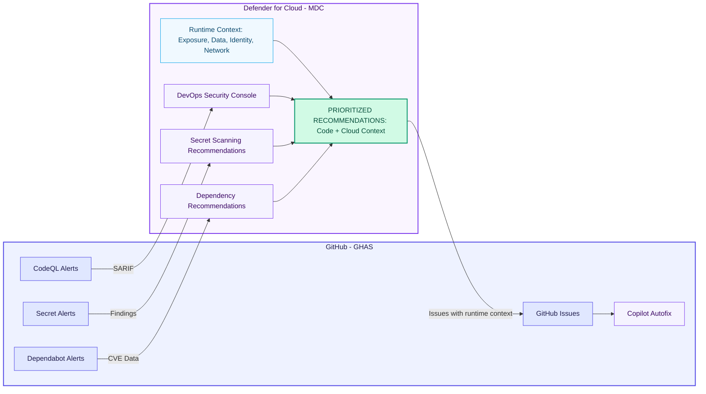
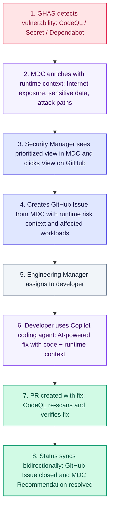

# GitHub Advanced Security + Microsoft Defender for Cloud
## L400 Technical Deep Dive -- Code-to-Cloud Security

> **Developer Productivity - GitHub Technical Insiders Community Call**
> April 2, 2026 | Prepared by Calin Lupas

---

## Table of Contents

0. [The Agentic DevSecOps Imperative](#0-the-agentic-devsecops-imperative)
1. [Architecture Overview](#1-architecture-overview)
   - [1.1 Threat Landscape: Why This Architecture Exists](#11-threat-landscape-why-this-architecture-exists)
2. [GitHub Advanced Security (GHAS) -- Deep Dive](#2-github-advanced-security-ghas--deep-dive)
   - [2.1 Product Structure (Post April 2025)](#21-product-structure-post-april-2025)
   - [2.2 Code Scanning with CodeQL](#22-code-scanning-with-codeql)
   - [2.3 Secret Scanning & Push Protection](#23-secret-scanning--push-protection)
   - [2.4 Copilot Autofix](#24-copilot-autofix)
   - [2.5 Security Campaigns](#25-security-campaigns)
   - [2.6 Dependabot & Supply Chain Security](#26-dependabot--supply-chain-security)
   - [2.7 GHAS REST & GraphQL APIs](#27-ghas-rest--graphql-apis)
3. [Microsoft Defender for Cloud (MDC) -- DevOps Security](#3-microsoft-defender-for-cloud-mdc--devops-security)
   - [3.1 DevOps Security Posture Management](#31-devops-security-posture-management)
   - [3.2 Agentless Code Scanning](#32-agentless-code-scanning)
   - [3.3 Code-to-Cloud Mapping](#33-code-to-cloud-mapping)
   - [3.4 Attack Path Analysis](#34-attack-path-analysis)
   - [3.5 Pull Request Annotations](#35-pull-request-annotations)
4. [GHAS + MDC Integration -- The Code-to-Cloud Bridge](#4-ghas--mdc-integration--the-code-to-cloud-bridge)
   - [4.1 Architecture & Data Flow](#41-architecture--data-flow)
   - [4.2 Smart Code-to-Cloud Mapping](#42-smart-code-to-cloud-mapping)
   - [4.3 Production-Aware Alert Prioritization](#43-production-aware-alert-prioritization)
   - [4.4 Unified AI-Driven Remediation Workflow](#44-unified-ai-driven-remediation-workflow)
   - [4.5 Licensing & Requirements](#45-licensing--requirements)
5. [Hands-On Configuration](#5-hands-on-configuration)
   - [5.1 Connecting GitHub to Defender for Cloud](#51-connecting-github-to-defender-for-cloud)
   - [5.2 Advanced CodeQL Configuration](#52-advanced-codeql-configuration)
   - [5.3 Custom Secret Scanning Patterns](#53-custom-secret-scanning-patterns)
   - [5.4 Delegated Bypass for Push Protection](#54-delegated-bypass-for-push-protection)
   - [5.5 Agentless Scanning Setup](#55-agentless-scanning-setup)
6. [CodeQL Query Language -- L400 Technical Reference](#6-codeql-query-language--l400-technical-reference)
   - [6.1 Data Flow Analysis](#61-data-flow-analysis)
   - [6.2 Taint Tracking](#62-taint-tracking)
   - [6.3 Writing Custom Security Queries](#63-writing-custom-security-queries)
7. [Enterprise Governance & Compliance](#7-enterprise-governance--compliance)
   - [Regulatory & Standards Alignment](#regulatory--standards-alignment)
8. [Best Practices & Operational Patterns](#8-best-practices--operational-patterns)
   - [DevSecOps Tooling Reference Matrix](#devsecops-tooling-reference-matrix)
9. [Agentic Security with GitHub Copilot](#9-agentic-security-with-github-copilot)
10. [References](#10-references)

---

## 0. The Agentic DevSecOps Imperative

The industry is undergoing a fundamental shift in how security is operationalized:

| Era | Paradigm | Security Model |
|-----|----------|----------------|
| **DevOps** (~2010s) | Automate pipelines, ship faster | Security as a gate at the end |
| **DevSecOps** (~2018+) | Shift left, embed scanning in CI/CD | Automated SAST/DAST/SCA in pipelines |
| **Agentic DevSecOps** (2025+) | AI agents operate autonomously across the SDLC | Continuous, context-aware security by AI agents with tool-use |

The shift to **Agentic DevSecOps** changes *who* is responsible for security decisions. GitHub Copilot custom agents can now review code for vulnerabilities before a human reviewer, generate threat models, harden CI/CD pipelines proactively, and audit supply chain health end-to-end.

**GHAS provides the detection layer** (CodeQL, secret scanning, Dependabot). **MDC provides the runtime context** (attack paths, exposure, cloud posture). **Copilot agents provide the autonomous remediation layer** -- consuming signals from both GHAS and MDC to act at machine speed.

> **Reference:** [GitHub Blog -- Agentic DevOps](https://github.blog/news-insights/product-news/github-copilot-the-agent-developer/)

---

## 1. Architecture Overview

The GHAS + MDC integration creates a **bidirectional code-to-cloud security fabric** that connects source code repositories to running cloud workloads. This architecture enables organizations to:

### 1.1 Threat Landscape: Why This Architecture Exists

Three incidents define the modern software supply chain threat model and directly justify the GHAS+MDC architecture:

| Incident | Attack Vector | Impact | GHAS+MDC Control |
|----------|--------------|--------|-------------------|
| **SolarWinds (2020)** | Malicious code injected into build pipeline | 18,000 customers deployed backdoored software, incl. 9 US federal agencies | Artifact Attestations (SLSA), pipeline hardening, MDC IaC scanning |
| **Codecov (2021)** | CI script modified to exfiltrate env secrets | 29,000 customers' CI secrets exfiltrated; downstream compromise of Twilio, HashiCorp | Secret Scanning push protection, pinned Actions, Security Pipeline Agent |
| **Log4Shell (2021)** | Zero-day RCE in Log4j 2.x (CVE-2021-44228) | 40% of global business networks targeted within 72 hours | Dependency Graph + Dependabot, MDC agentless SCA, SBOM generation |

> These three incidents are not historical curiosities -- they are the **threat model** that the GHAS+MDC architecture is designed to prevent. Each maps to a specific pillar: supply chain integrity, secret management, and dependency risk.



**Key Integration Points:**

| Layer | Technology | Function |
|-------|-----------|----------|
| Source Code | GHAS Secret Protection | Pre-commit & push-time secret detection |
| Pull Request | GHAS Code Security + MDC PR Annotations | CodeQL SAST + IaC scanning with cloud context |
| CI/CD Pipeline | CodeQL Actions + MDC Agentless Scanning | Automated vulnerability detection |
| Cloud Runtime | Defender CSPM | Runtime risk context, attack paths |
| Remediation | Copilot Autofix + MDC Issue Assignment | AI-driven fix suggestions with cloud context |

---

## 2. GitHub Advanced Security (GHAS) -- Deep Dive

### 2.1 Product Structure (Post April 2025)

Announced **March 4, 2025** and generally available **April 1, 2025**, GitHub restructured GHAS into two standalone products, expanding availability beyond Enterprise plans:

| Product | What's Included | Availability |
|---------|----------------|-------------|
| **GitHub Secret Protection** | Secret scanning, push protection, AI-powered detection, custom patterns, delegated bypass, validity checks | GitHub Team + Enterprise Cloud |
| **GitHub Code Security** | CodeQL code scanning, Copilot Autofix, Dependabot, security campaigns, third-party SARIF | GitHub Team + Enterprise Cloud |

**Pricing Model:** Per-active-committer, pay-as-you-go ($19/month for Secret Protection, $30/month for Code Security). Only users who commit to repositories with these features enabled are counted.

> **Note:** On GitHub Enterprise Server (GHES), GHAS is included in the Enterprise license and is not a separate per-committer add-on. The Secret Protection / Code Security split applies to GitHub Enterprise Cloud (GHEC) and Team plans.

> **Reference:** [GitHub Blog -- Introducing GitHub Secret Protection and GitHub Code Security](https://github.blog/changelog/2025-03-04-introducing-github-secret-protection-and-github-code-security/)

### 2.2 Code Scanning with CodeQL

CodeQL is GitHub's **semantic code analysis engine** that treats code as data. It creates a relational database from your source code and runs queries written in the QL query language against it.

#### Supported Languages

| Language | Build Mode | CodeQL Version |
|----------|-----------|----------------|
| C/C++ | `autobuild` or manual | 2.x+ |
| C# | `autobuild` or manual | 2.x+ |
| Go | `autobuild` | 2.x+ |
| Java/Kotlin | `autobuild` or manual | 2.x+ |
| JavaScript/TypeScript | No build required | 2.x+ |
| Python | No build required | 2.x+ |
| Ruby | No build required | 2.x+ |
| Swift | `autobuild` or manual | 2.x+ |

#### Analysis Modes

1. **Default Setup** -- Zero-config, GitHub manages everything:
   ```yaml
   # Automatically configured -- no workflow file needed
   # GitHub detects languages and runs CodeQL on:
   # - Every push to default branch
   # - Every pull request to default branch
   # - Weekly scheduled scan
   ```

2. **Advanced Setup** -- Full control via workflow:
   ```yaml
   name: "CodeQL Advanced Analysis"
   on:
     push:
       branches: [main, release/*]
     pull_request:
       branches: [main]
     schedule:
       - cron: '30 1 * * 1'  # Weekly Monday 1:30 AM UTC

   jobs:
     analyze:
       name: Analyze (${{ matrix.language }})
       runs-on: ${{ matrix.language == 'swift' && 'macos-latest' || 'ubuntu-latest' }}
       permissions:
         security-events: write
         packages: read
         actions: read
         contents: read
       strategy:
         fail-fast: false
         matrix:
           include:
             - language: javascript-typescript
               build-mode: none
             - language: python
               build-mode: none
             - language: csharp
               build-mode: autobuild
       steps:
         - name: Checkout repository
           uses: actions/checkout@v4

         - name: Initialize CodeQL
           uses: github/codeql-action/init@v3
           with:
             languages: ${{ matrix.language }}
             build-mode: ${{ matrix.build-mode }}
             queries: +security-extended,security-and-quality
             config-file: ./.github/codeql/codeql-config.yml

         - if: matrix.build-mode == 'manual'
           name: Manual build
           run: |
             dotnet build --configuration Release

         - name: Perform CodeQL Analysis
           uses: github/codeql-action/analyze@v3
           with:
             category: "/language:${{ matrix.language }}"
   ```

3. **CodeQL CLI** -- For CI/CD integration beyond GitHub Actions:
   ```bash
   # Create a database for analysis
   codeql database create ./codeql-db \
     --language=csharp \
     --command="dotnet build /t:rebuild" \
     --source-root=./src

   # Run analysis with specific query suites
   codeql database analyze ./codeql-db \
     codeql/csharp-queries:codeql-suites/csharp-security-extended.qls \
     --format=sarif-latest \
     --output=results.sarif \
     --threads=0

   # Upload results to GitHub
   codeql github upload-results \
     --sarif=results.sarif \
     --repository=org/repo \
     --ref=refs/heads/main \
     --commit=$(git rev-parse HEAD)
   ```

#### Query Suites

| Suite | Description | Use Case |
|-------|-------------|----------|
| `code-scanning` | Default balanced queries | Standard CI/CD |
| `security-extended` | More security queries, more results | Security-focused teams |
| `security-and-quality` | Security + code quality queries | Comprehensive analysis |

> **Reference:** [GitHub Docs -- About CodeQL](https://docs.github.com/en/code-security/code-scanning/introduction-to-code-scanning/about-code-scanning-with-codeql)

### 2.3 Secret Scanning & Push Protection

#### Secret Scanning Architecture

Secret scanning operates at multiple levels:



**Detection Capabilities:**

| Capability | Description |
|-----------|-------------|
| **Partner Patterns** | 200+ token formats from cloud providers, SaaS platforms, package registries |
| **AI-Powered Generic Detection** | Uses ML models to detect unstructured secrets (passwords, connection strings) |
| **Custom Patterns** | Organization-defined regex patterns for internal secret formats |
| **Validity Checks** | Automated verification with partner APIs to confirm if a detected secret is active |
| **Push Protection** | Real-time blocking of commits containing secrets before they reach the repository |
| **Free Secret Risk Assessment** | Point-in-time scan of all repos (incl. private/internal/archived) -- no license required |

#### Free Secret Risk Assessment

Organizations on Team or Enterprise plans can run a **free secret risk assessment** that scans all repositories -- including private, internal, and archived -- and returns aggregate metrics as a downloadable CSV. Key details:

- **Scope:** Scans entire organization footprint for exposed secrets
- **Output:** Secret types found, affected repositories, public exposure risk
- **Frequency:** Runnable once per 90 days
- **License:** No Secret Protection or Code Security license required
- **Use Case:** Ideal for building the business case for Secret Protection adoption

> **Reference:** [GitHub Blog -- Free Secret Risk Assessment](https://github.blog/changelog/2025-03-04-introducing-github-secret-protection-and-github-code-security/)

#### Push Protection -- Technical Flow



#### Custom Pattern Configuration

```yaml
# Organization-level custom pattern example
# Settings -> Code security -> Secret scanning -> Custom patterns

# Pattern: Internal API Gateway Token
Name: "Internal API Gateway Token"
Secret format: "APIGW-[A-Za-z0-9]{32}"
Before secret: "(token|key|secret)\\s*[:=]\\s*['\"]?"
After secret: "['\"]?"

# After publishing, enable push protection for this pattern:
# Settings -> Advanced Security -> Push Protection -> Enable for pattern
```

> **Reference:** [GitHub Docs -- About Secret Scanning](https://docs.github.com/en/code-security/secret-scanning/introduction/about-secret-scanning)
> **Reference:** [GitHub Docs -- Defining Custom Patterns](https://docs.github.com/code-security/secret-scanning/using-advanced-secret-scanning-and-push-protection-features/custom-patterns)

### 2.4 Copilot Autofix

Copilot Autofix is GitHub's **AI-powered vulnerability remediation** engine that generates code fixes directly in pull requests.

#### How It Works (Internal Architecture)



**Supported Vulnerability Classes:**

| CWE | Vulnerability | Autofix Quality |
|-----|--------------|-----------------|
| CWE-79 | Cross-Site Scripting (XSS) | High |
| CWE-89 | SQL Injection | High |
| CWE-78 | OS Command Injection | High |
| CWE-22 | Path Traversal | High |
| CWE-502 | Deserialization of Untrusted Data | Medium |
| CWE-918 | Server-Side Request Forgery | Medium |
| CWE-327 | Broken Cryptographic Algorithm | High |
| CWE-798 | Hard-coded Credentials | High |

> **Reference:** [Visual Studio Magazine -- Mission Copilot Autofix](https://visualstudiomagazine.com/articles/2025/06/17/mission-copilot-autofix-securing-the-worlds-software-with-github-advanced-security.aspx)

### 2.5 Security Campaigns

Security campaigns enable **organization-wide remediation** of security debt at scale.

> **Security Debt by the Numbers:**
> - **70.8%** of organizations carry active security debt (Veracode SOSS 2024)
> - **89.4%** of security debt lives in **first-party code** -- making code scanning the primary lever
> - Copilot Autofix reduces SQL injection fix time from **~3.7 hours to ~18 minutes** -- over 12x faster (Source: [GitHub -- Found Means Fixed](https://github.blog/security/application-security/found-means-fixed-secure-code-more-than-three-times-faster-with-copilot-autofix/))
> - The average vulnerability remains open for **94 days** before remediation -- Security Campaigns target this long tail

#### Campaign Workflow

```
+----------------------------------------------------------+
|                   SECURITY CAMPAIGN                       |
|                                                          |
|  1. Security Manager identifies systemic vulnerability   |
|     (e.g., all SQL injection alerts across 200 repos)    |
|                                                          |
|  2. Create campaign targeting specific CWEs or rules     |
|     across selected repositories                         |
|                                                          |
|  3. GitHub generates GitHub Issues in affected repos     |
|     with runtime context from MDC (if integrated)        |
|                                                          |
|  4. Developers receive assignments with:                 |
|     - Vulnerability details & data flow paths            |
|     - Copilot Autofix suggestions                        |
|     - Runtime risk context (Internet exposure, etc.)     |
|                                                          |
|  5. Campaign dashboard tracks progress:                  |
|     - Fixed / Open / In-Progress / Dismissed alerts      |
|     - Per-team and per-repo metrics                      |
|     - SLA compliance                                     |
|                                                          |
|  6. Bidirectional sync: fix status reflected in both     |
|     GitHub and Defender for Cloud                        |
+----------------------------------------------------------+
```

**Organization Security Configuration (Policy-as-Code):**

```yaml
# Organization-wide security configuration
# Applied via: Settings -> Code security -> Configurations

Security Configuration: "Production-Critical"
  code_scanning:
    enabled: true
    default_setup: true
    query_suite: security-extended
    autofix: enabled
    alert_threshold: error  # Block PRs on high/critical
  secret_scanning:
    enabled: true
    push_protection: enforced
    delegated_bypass:
      enabled: true
      reviewers: ["@org/security-team"]
    validity_checks: enabled
    non_provider_patterns: enabled
  dependabot:
    alerts: enabled
    security_updates: enabled
    version_updates: enabled
  private_vulnerability_reporting: enabled
  enforcement: enforced  # Cannot be overridden at repo level
```

> **Reference:** [GitHub Community -- GHAS Code Security Series](https://github.com/orgs/community/discussions/177178)

### 2.6 Dependabot & Supply Chain Security

#### Supply Chain Security Stack

| Feature | Function | Automation Level |
|---------|----------|-----------------|
| **Dependency Graph** | Maps all dependencies (direct + transitive) | Automatic |
| **Dependabot Alerts** | Matches dependencies against GitHub Advisory Database | Automatic |
| **Dependabot Security Updates** | Creates PRs to update vulnerable dependencies | Semi-automatic |
| **Dependabot Version Updates** | Keeps dependencies up-to-date on schedule | Configurable |
| **Dependency Review** | PR check to prevent adding new vulnerabilities | Automatic |

#### Dependabot Configuration

```yaml
# .github/dependabot.yml
version: 2
updates:
  - package-ecosystem: "npm"
    directory: "/"
    schedule:
      interval: "weekly"
      day: "monday"
    reviewers:
      - "org/platform-team"
    labels:
      - "dependencies"
      - "security"
    open-pull-requests-limit: 10
    security-updates-only: false
    groups:
      production-dependencies:
        dependency-type: "production"
        update-types:
          - "minor"
          - "patch"
      development-dependencies:
        dependency-type: "development"
        update-types:
          - "minor"
          - "patch"

  - package-ecosystem: "docker"
    directory: "/"
    schedule:
      interval: "weekly"

  - package-ecosystem: "github-actions"
    directory: "/"
    schedule:
      interval: "weekly"
```

#### Software Bill of Materials (SBOM)

GitHub natively exports SBOMs in **SPDX 2.3** format for any repository via the dependency graph:

```bash
# REST API -- export SBOM
GET /repos/{owner}/{repo}/dependency-graph/sbom

# GitHub CLI
gh api /repos/{owner}/{repo}/dependency-graph/sbom --jq '.sbom'

# Pipeline SBOM generation with Anchore Syft
- name: Generate SBOM
  uses: anchore/sbom-action@v0
  with:
    format: spdx-json
    output-file: sbom.spdx.json
```

> **Reference:** [GitHub Docs -- Exporting a Software Bill of Materials](https://docs.github.com/en/code-security/supply-chain-security/understanding-your-software-supply-chain/exporting-a-software-bill-of-materials-for-your-repository)

#### Artifact Attestations & SLSA Compliance

GitHub **Artifact Attestations** (GA June 2024) generate cryptographically signed build provenance, satisfying **SLSA v1.0 Build Level 2+**:

```yaml
# .github/workflows/release.yml
jobs:
  build:
    permissions:
      id-token: write
      attestations: write
      contents: read
    steps:
      - uses: actions/checkout@v4
      - name: Build
        run: docker build -t myapp:${{ github.sha }} .
      - name: Attest build provenance
        uses: actions/attest-build-provenance@v2
        with:
          subject-name: ghcr.io/myorg/myapp
          subject-digest: sha256:${{ steps.build.outputs.digest }}
```

**Verification:**
```bash
gh attestation verify oci://ghcr.io/myorg/myapp:latest --repo myorg/myapp
```

| SLSA Level | Requirement | GitHub Capability |
|-----------|-------------|-------------------|
| Build L1 | Provenance exists | `actions/attest-build-provenance` |
| Build L2 | Hosted, tamper-resistant build | GitHub Actions + Artifact Attestations |
| Build L3 | Hardened build platform | GitHub Actions + Reusable Workflows |

> **Reference:** [GitHub Docs -- Using Artifact Attestations](https://docs.github.com/en/actions/security-for-github-actions/using-artifact-attestations)

#### OpenSSF Scorecard

```yaml
# .github/workflows/scorecard.yml
on:
  schedule:
    - cron: '30 1 * * 6'
  push:
    branches: [main]

jobs:
  analysis:
    runs-on: ubuntu-latest
    permissions:
      security-events: write
      id-token: write
      contents: read
    steps:
      - uses: ossf/scorecard-action@v2
        with:
          results_file: scorecard.sarif
          results_format: sarif
          publish_results: true
      - uses: github/codeql-action/upload-sarif@v3
        with:
          sarif_file: scorecard.sarif
```

Key checks: Branch-Protection, Code-Review, Dangerous-Workflow, Dependency-Update-Tool, Pinned-Dependencies, SAST, Signed-Releases, Token-Permissions, Vulnerabilities. Target **7+/10** for healthy supply chain posture.

> **Reference:** [OpenSSF Scorecard](https://scorecard.dev/)

### 2.7 GHAS REST & GraphQL APIs

#### REST API Endpoints

```bash
# List code scanning alerts for a repository
GET /repos/{owner}/{repo}/code-scanning/alerts
# Response: Alert ID, rule, severity, state, SARIF info, location

# Get specific alert details
GET /repos/{owner}/{repo}/code-scanning/alerts/{alert_number}

# List secret scanning alerts
GET /repos/{owner}/{repo}/secret-scanning/alerts
# Response: Secret type, locations, push protection bypass info

# Organization-level: List all alerts
GET /orgs/{org}/code-scanning/alerts?state=open&severity=critical

# Enterprise-level: Security configurations
GET /enterprises/{enterprise}/code-security/configurations
POST /enterprises/{enterprise}/code-security/configurations
```

#### GraphQL API -- Vulnerability Alerts

```graphql
{
  repository(name: "my-repo", owner: "my-org") {
    vulnerabilityAlerts(first: 100, states: [OPEN]) {
      nodes {
        createdAt
        dismissedAt
        fixedAt
        state
        securityVulnerability {
          package {
            name
            ecosystem
          }
          advisory {
            ghsaId
            summary
            severity
            cvss {
              score
              vectorString
            }
            cwes(first: 5) {
              nodes {
                cweId
                name
              }
            }
          }
          firstPatchedVersion {
            identifier
          }
          vulnerableVersionRange
        }
      }
      totalCount
    }
  }
}
```

#### Webhook Events for Automation

```json
// Webhook: code_scanning_alert
{
  "action": "created",
  "alert": {
    "number": 42,
    "rule": {
      "id": "js/sql-injection",
      "severity": "error",
      "security_severity_level": "critical",
      "description": "Database query built from user-controlled sources"
    },
    "tool": { "name": "CodeQL", "version": "2.18.0" },
    "most_recent_instance": {
      "location": {
        "path": "src/api/users.js",
        "start_line": 45,
        "end_line": 47
      }
    }
  }
}
```

> **Reference:** [GitHub Docs -- REST API for Security Advisories](https://docs.github.com/en/rest/security-advisories)
> **Reference:** [GitHub Docs -- REST API for Code Scanning](https://docs.github.com/en/rest/code-scanning/code-scanning)

---

## 3. Microsoft Defender for Cloud (MDC) -- DevOps Security

### 3.1 DevOps Security Posture Management

Defender for Cloud's DevOps security provides a **centralized security console** across multiple DevOps platforms:

| Platform | Connector | Features |
|----------|-----------|----------|
| **GitHub** | Native GitHub App | Code scanning, secret scanning, dependency scanning, IaC scanning, PR annotations |
| **Azure DevOps** | Azure DevOps extension | Same as GitHub + pipeline security |
| **GitLab** | OAuth integration | Code scanning, secret scanning, IaC scanning |

#### DevOps Security Dashboard Metrics

The DevOps security console surfaces:

- **Total scan findings** grouped by severity (Critical / High / Medium / Low)
- **Finding types**: Code vulnerabilities, secrets, dependencies, IaC misconfigurations
- **Advanced security coverage**: Repos with GHAS enabled vs. total onboarded
- **Posture management recommendations**: Environment-level security configuration issues
- **Pull request annotation status**: Repos with PR annotations enabled

#### DevOps Inventory View

| Column | Description |
|--------|-------------|
| **Name** | Onboarded repository/project name |
| **DevOps Environment** | GitHub, Azure DevOps, or GitLab |
| **Advanced Security Status** | On / Off / Partially enabled / N/A |
| **PR Annotation Status** | On / Off / N/A |
| **Findings** | Total code, secret, dependency, and IaC findings |

> **Reference:** [Microsoft Learn -- Overview of Defender for Cloud DevOps Security](https://learn.microsoft.com/en-us/azure/defender-for-cloud/defender-for-devops-introduction)

### 3.2 Agentless Code Scanning

Agentless code scanning is a **zero-pipeline-change** approach to scanning all repositories:

#### Architecture

```mermaid
graph TB
    subgraph SCAN["AGENTLESS CODE SCANNING"]
        CONN["GitHub / Azure DevOps Connector"] --> ENGINE["Defender for Cloud Scanning Engine"]

        subgraph SCANNERS["Scanner Suite"]
            S1["Bandit - Python"]
            S2["ESLint - JS/TS"]
            S3["Checkov - IaC: Terraform, K8s, Docker, ARM"]
            S4["Terrascan - IaC"]
            S5["Template Analyzer - ARM, Bicep"]
        end

        ENGINE --> SCANNERS
        SCANNERS --> REC["Security Recommendations - File, Line, Rule, Fix"]
    end

    style SCAN fill:#faf5ff,stroke:#7c3aed,stroke-width:2px,color:#3b0764
    style CONN fill:#e0e7ff,stroke:#4f46e5,color:#1e1b4b
    style ENGINE fill:#f5f3ff,stroke:#7c3aed,color:#3b0764
    style SCANNERS fill:#f8fafc,stroke:#94a3b8,stroke-width:1px,color:#334155
    style S1 fill:#f1f5f9,stroke:#64748b,color:#1e293b
    style S2 fill:#f1f5f9,stroke:#64748b,color:#1e293b
    style S3 fill:#f1f5f9,stroke:#64748b,color:#1e293b
    style S4 fill:#f1f5f9,stroke:#64748b,color:#1e293b
    style S5 fill:#f1f5f9,stroke:#64748b,color:#1e293b
    style REC fill:#d1fae5,stroke:#059669,color:#064e3b
```



**Key Properties:**

| Property | Detail |
|----------|--------|
| **Pipeline changes** | None required |
| **Scope** | Customizable: org, project, or repo level |
| **Scanners** | Configurable per language/framework |
| **IaC support** | ARM/Bicep, Terraform, Kubernetes manifests, Dockerfiles, CloudFormation |
| **Frequency** | Automatic on connector setup; continuous |

#### Supported Scanners & Languages

| Scanner | Target | Language/Framework |
|---------|--------|--------------------|
| Bandit | Application code | Python |
| ESLint (security rules) | Application code | JavaScript/TypeScript |
| Checkov | IaC | Terraform, Kubernetes, Dockerfile, ARM, Bicep, CloudFormation |
| Terrascan | IaC | Terraform, Kubernetes, Helm, Dockerfile |
| Template Analyzer | IaC | ARM, Bicep |

> **Reference:** [Microsoft Learn -- Configure Agentless Code Scanning](https://learn.microsoft.com/en-us/azure/defender-for-cloud/agentless-code-scanning)

### 3.3 Code-to-Cloud Mapping

Defender for Cloud uses **proprietary code-to-cloud mapping methods** to automatically trace:

```
Source Repository <----- maps to ------> Cloud Workload

Example:
  github.com/contoso/api-service   <----->  AKS cluster: prod-east-001
  /src/Dockerfile                   <----->  Container image: contoso.azurecr.io/api:v2.1.3
  CVE-2024-1234 in code             <----->  Running pod with internet exposure
```

**Mapping Dimensions:**

| Dimension | Description |
|-----------|-------------|
| **Repository -> Workload** | Which code repo deploys to which cloud resource |
| **Build Artifact -> Runtime** | Container images traced from Dockerfile to running pods |
| **CVE -> Runtime Exposure** | Code vulnerabilities linked to their runtime risk context |
| **Developer -> Fix Owner** | Code commit history identifies who should fix what |

### 3.4 Attack Path Analysis

Defender CSPM provides **contextual attack path analysis** that chains vulnerabilities:



**Risk Factors Analyzed:**

| Risk Factor | Description |
|-------------|-------------|
| **Internet Exposure** | Workload is publicly accessible |
| **Sensitive Data** | Workload accesses PII, financial data, or secrets |
| **Critical Resources** | Workload is tagged as business-critical |
| **Lateral Movement** | Compromising this workload could pivot to other resources |
| **Identity Risk** | Over-permissioned service principals or managed identities |

### 3.5 Pull Request Annotations

MDC can annotate pull requests with security findings directly in the developer workflow:



**Requirements for PR Annotations:**
- Defender CSPM plan enabled
- GitHub connector configured in Defender for Cloud
- Microsoft Security DevOps GitHub Action or agentless scanning configured

> **Reference:** [Microsoft Learn -- Enable Pull Request Annotations](https://learn.microsoft.com/en-us/azure/defender-for-cloud/enable-pull-request-annotations)

---

## 4. GHAS + MDC Integration -- The Code-to-Cloud Bridge

### 4.1 Architecture & Data Flow



### 4.2 Smart Code-to-Cloud Mapping

The native GHAS + MDC integration (currently in preview for container workloads) automatically maps:

1. **Source -> Runtime**: GitHub repositories are linked to their deployed cloud workloads using Defender for Cloud's proprietary code-to-cloud mapping
2. **CVE Tracking**: Every CVE found in code is linked to the specific container image and running pod in your cloud environment
3. **Build Artifact Tracing**: Dockerfile -> Container Registry -> AKS/ACI/App Service deployment chain is fully traced

**Technical Implementation:**

```
GitHub Org: contoso
  +-- Repository: api-service
       +-- Dockerfile -> builds -> contoso.azurecr.io/api:sha-abc123
                                        |
                    MDC Container Scanning <------+
                                        |
                    Maps to:  AKS Cluster -> Namespace -> Pod
                              |
                    Runtime Context Applied:
                    - Internet-facing load balancer
                    - Accesses Azure SQL with sensitive data
                    - Service principal has Key Vault access
```

### 4.3 Production-Aware Alert Prioritization

GHAS findings in GitHub are enriched with MDC runtime risk factors:

| Risk Factor | Source | Impact on Priority |
|-------------|--------|-------------------|
| Internet Exposure | MDC Network Analysis | +Critical if public-facing |
| Sensitive Data Access | MDC Data Classification | +High if PII/financial data |
| Critical Resource | MDC Resource Tags | +High if production workload |
| Lateral Movement | MDC Attack Path Analysis | +Critical if pivot point |
| Identity Risk | MDC Identity Analysis | +High if over-permissioned |

### 4.4 Unified AI-Driven Remediation Workflow



> **Reference:** [Microsoft Learn -- GHAS Integration with MDC](https://learn.microsoft.com/en-us/azure/defender-for-cloud/github-advanced-security-overview)

### 4.5 Licensing & Requirements

| Feature | Required License |
|---------|-----------------|
| GHAS Code Scanning (CodeQL) | GitHub Code Security |
| GHAS Secret Scanning + Push Protection | GitHub Secret Protection |
| Copilot Autofix (PR suggestions) | GitHub Code Security (included) |
| Copilot Coding Agent (interactive) | GitHub Copilot Enterprise or Copilot Pro+ |
| MDC DevOps Security (basic) | Defender for Cloud (Free tier) |
| MDC Agentless Code Scanning | Defender CSPM |
| MDC PR Annotations | Defender CSPM |
| MDC Code-to-Cloud Mapping | Defender CSPM |
| MDC Attack Path Analysis | Defender CSPM |
| GHAS + MDC Native Integration | GitHub Code Security + Defender CSPM |

**Azure Permissions Required:**

| Role | Scope | Purpose |
|------|-------|---------|
| Account Administrator | Azure Portal | Initial setup |
| Contributor | Azure Subscription | Create GitHub connector |
| Security Reader | Resource Group / Connector | Read DevOps posture |
| Organization Owner | GitHub | Authorize Defender for Cloud app |

---

## 5. Hands-On Configuration

> **Demo Repository:** All hands-on examples reference the companion repository: [`githubabcs-devops/gh-advsec-devsecops`](https://github.com/githubabcs-devops/gh-advsec-devsecops) -- pre-configured GHAS settings, CodeQL queries, MSDO workflows, security agents, and intentional vulnerabilities for demo.

### 5.1 Connecting GitHub to Defender for Cloud

**Step-by-step in Azure Portal:**

```
1. Azure Portal -> Microsoft Defender for Cloud -> Environment settings
2. Add environment -> Select "GitHub"
3. Enter connector name (<=20 chars), select subscription, resource group, region
4. Configure access -> Authorize (OAuth to GitHub)
5. Install Defender for Cloud GitHub App on target organizations
6. Select scope: "All existing and future organizations" (recommended)
7. Review and Create
```

**Post-Setup Verification:**

```bash
# Verify connector status via Azure CLI
az security connector list \
  --resource-group "rg-security" \
  --query "[?environmentName=='GitHub']" \
  --output table

# Check DevOps inventory
az security devops-resource list \
  --resource-group "rg-security" \
  --security-connector-name "github-connector" \
  --output table
```

**Expected Timeline:**
- Resources appear in inventory: **up to 8 hours**
- Security scanning recommendations: **may require additional workflow configuration**
- Findings refresh: **varies by recommendation type**

> **Reference:** [Microsoft Learn -- Quick Start: Connect GitHub to Defender for Cloud](https://learn.microsoft.com/en-us/azure/defender-for-cloud/quickstart-onboard-github)

### 5.2 Advanced CodeQL Configuration

#### Custom Configuration File

```yaml
# .github/codeql/codeql-config.yml
name: "Enterprise Security Configuration"

# Disable default queries and use only custom + extended
disable-default-queries: false

queries:
  # Use extended security suite
  - uses: security-extended

  # Add custom query pack from private registry
  - uses: my-org/custom-security-queries@v2.1.0

  # Add local custom queries
  - uses: ./custom-queries

# Path filters
paths-ignore:
  - '**/test/**'
  - '**/tests/**'
  - '**/vendor/**'
  - '**/node_modules/**'

paths:
  - 'src'
  - 'lib'

# Threat model (JavaScript/TypeScript specific)
threat-models:
  - local    # Include local sources (files, CLI args)
  - remote   # Include remote sources (HTTP requests)
```

#### Custom Query Pack Structure

```
custom-queries/
+-- qlpack.yml
+-- src/
|   +-- SqlInjectionCustomSink.ql
|   +-- HardcodedConnectionString.ql
|   +-- InsecureDeserialization.ql
+-- test/
    +-- SqlInjectionCustomSink/
    |   +-- test.cs
    +-- HardcodedConnectionString/
        +-- test.py
```

```yaml
# custom-queries/qlpack.yml
name: my-org/custom-security-queries
version: 2.1.0
dependencies:
  codeql/csharp-all: "*"
  codeql/python-all: "*"
  codeql/javascript-all: "*"
```

### 5.3 Custom Secret Scanning Patterns

```
# Navigate to: Organization Settings -> Code security -> Secret scanning

# Example: Azure AD Client Secret (custom format)
Pattern Name: "Contoso Internal Service Key"
Secret format regex: CSK-[A-F0-9]{8}-[A-F0-9]{4}-[A-F0-9]{4}-[A-F0-9]{4}-[A-F0-9]{12}
Before secret (optional): (service[_-]?key|internal[_-]?token)\s*[:=]\s*['"]?
After secret (optional): ['"]?\s*[;,\n]

# Dry run: Tests against up to 1,000 repository matches
# Publish -> Enable push protection for this pattern
```

### 5.4 Delegated Bypass for Push Protection

```
# Configure at Organization level:
# Settings -> Code security -> Push protection -> "Who can bypass push protection"

Option: "Specific roles or teams"
Bypass reviewers: @org/security-champions

# Workflow:
# 1. Developer pushes commit with detected secret
# 2. Push is blocked; developer can "Request bypass"
# 3. @org/security-champions receive notification
# 4. Reviewer sees: user, repo, commit, timestamp, file paths
# 5. Reviewer approves or denies (7-day window)
# 6. All actions are fully audited in the audit log
```

### 5.5 Agentless Scanning Setup

```
# In Defender for Cloud:
# Environment settings -> GitHub connector -> Settings

# Enable agentless scanning:
# 1. Toggle "Agentless code scanning" to ON
# 2. Configure scope:
#    - All organizations (recommended)
#    - Specific organizations
#    - Specific repositories
# 3. Select scanners:
#    - Application code scanners (Bandit, ESLint)
#    - IaC scanners (Checkov, Terrascan, Template Analyzer)
# 4. Save configuration

# No YAML changes required in any repository
# Scanning begins automatically
```

---

## 6. CodeQL Query Language -- L400 Technical Reference

### 6.1 Data Flow Analysis

CodeQL models code as a **relational database** and uses **data flow analysis** to track value propagation.

#### Local Data Flow (Intra-procedural)

```ql
/**
 * @name Find local flow from user input to SQL query
 * @description Tracks data from HTTP request parameters to SQL execution within a single method
 * @kind path-problem
 * @problem.severity error
 * @security-severity 9.8
 * @precision high
 * @id cs/sql-injection-local
 * @tags security
 *       external/cwe/cwe-089
 */

import csharp
import semmle.code.csharp.dataflow.DataFlow

from DataFlow::Node source, DataFlow::Node sink
where
  // Source: HTTP request QueryString property access
  source.asExpr().(PropertyRead).getTarget().hasName("QueryString") and
  // Sink: SQL command text
  sink.asExpr() = any(Assignment a |
    a.getLValue().(PropertyAccess).getTarget().hasName("CommandText")
  ).getRValue() and
  // Local flow exists
  DataFlow::localFlow(source, sink)
select sink, source, sink, "SQL query built from user-controlled $@.", source, "input"
```

#### Global Data Flow (Inter-procedural)

```ql
/**
 * @name SQL injection via user input (global flow)
 * @kind path-problem
 * @problem.severity error
 * @security-severity 9.8
 * @id cs/sql-injection-global
 */

import csharp
import semmle.code.csharp.dataflow.DataFlow
import DataFlow::PathGraph

module SqlInjectionConfig implements DataFlow::ConfigSig {
  predicate isSource(DataFlow::Node source) {
    exists(Parameter p |
      p.getType().hasName("HttpRequest") and
      source.asParameter() = p
    )
  }

  predicate isSink(DataFlow::Node sink) {
    exists(MethodAccess ma |
      ma.getTarget().hasName("ExecuteSqlRaw") and
      sink.asExpr() = ma.getArgument(0)
    )
  }
}

module SqlInjectionFlow = DataFlow::Global<SqlInjectionConfig>;

from SqlInjectionFlow::PathNode source, SqlInjectionFlow::PathNode sink
where SqlInjectionFlow::flowPath(source, sink)
select sink.getNode(), source, sink,
  "This SQL query depends on a $@.", source.getNode(), "user-provided value"
```

### 6.2 Taint Tracking

Taint tracking extends data flow analysis to track data through **transformations** (string concatenation, encoding, etc.):

```ql
/**
 * @name XSS via tainted user input
 * @kind path-problem
 * @problem.severity error
 * @security-severity 8.0
 * @id js/xss-tainted
 */

import javascript
import semmle.javascript.security.dataflow.RemoteFlowSources

module XssConfig implements TaintTracking::ConfigSig {
  predicate isSource(DataFlow::Node source) {
    // Track from any HTTP request parameter
    source instanceof RemoteFlowSource
  }

  predicate isSink(DataFlow::Node sink) {
    // Sink: innerHTML assignment
    exists(DataFlow::PropWrite pw |
      pw.getPropertyName() = "innerHTML" and
      sink = pw.getRhs()
    )
  }

  predicate isBarrier(DataFlow::Node node) {
    // Sanitizer: DOMPurify.sanitize()
    exists(CallExpr call |
      call.getCalleeName() = "sanitize" and
      node.asExpr() = call
    )
  }
}

module XssFlow = TaintTracking::Global<XssConfig>;

from XssFlow::PathNode source, XssFlow::PathNode sink
where XssFlow::flowPath(source, sink)
select sink.getNode(), source, sink,
  "Cross-site scripting vulnerability from $@.", source.getNode(), "user input"
```

### 6.3 Writing Custom Security Queries

#### Query Metadata (Required for SARIF Integration)

```ql
/**
 * @name <Short description>
 * @description <Detailed explanation>
 * @kind problem | path-problem | metric
 * @problem.severity error | warning | recommendation
 * @security-severity 0.0-10.0  (CVSS score)
 * @precision very-high | high | medium | low
 * @id <language>/<unique-id>
 * @tags security
 *       external/cwe/cwe-XXX
 *       external/owasp/owasp-XXX
 */
```

#### Example: Detect Hard-coded Azure Connection Strings

```ql
/**
 * @name Hard-coded Azure connection string
 * @description Detects Azure Storage or SQL connection strings embedded directly in source code
 * @kind problem
 * @problem.severity error
 * @security-severity 8.6
 * @precision high
 * @id cs/hardcoded-azure-connection-string
 * @tags security
 *       external/cwe/cwe-798
 */

import csharp

from StringLiteral s
where
  (
    s.getValue().regexpMatch(".*DefaultEndpointsProtocol=https?;AccountName=.*") or
    s.getValue().regexpMatch(".*Server=tcp:.*database\\.windows\\.net.*") or
    s.getValue().regexpMatch(".*AccountKey=[A-Za-z0-9+/=]{44,}.*")
  ) and
  not s.getFile().getRelativePath().matches("%test%") and
  not s.getFile().getRelativePath().matches("%Test%")
select s, "Hard-coded Azure connection string found. Use Azure Key Vault or environment variables instead."
```

> **Reference:** [CodeQL Docs -- About Data Flow Analysis](https://codeql.github.com/docs/writing-codeql-queries/about-data-flow-analysis/)
> **Reference:** [CodeQL Docs -- Taint Tracking](https://codeql.github.com/docs/codeql-language-guides/)
> **Reference:** [GitHub Blog -- How GitHub Uses CodeQL to Secure GitHub](https://github.blog/engineering/how-github-uses-codeql-to-secure-github/)

---

## 7. Enterprise Governance & Compliance

### Security Configuration Hierarchy

```
Enterprise
  +-- Organization
       +-- Repository

Enforcement flows top-down:
- Enterprise sets baseline policies
- Organization can extend (not weaken) if enforcement is "enforced"
- Repository inherits unless organization allows override
```

### Audit Log Integration

```bash
# GitHub Enterprise audit log: Security events
# Filter by: action:code_scanning_alert.created
# Filter by: action:secret_scanning_alert.created
# Filter by: action:push_protection.bypass

# Stream to SIEM via audit log streaming:
# Supported targets: Azure Event Hubs, Splunk, S3, Datadog, Microsoft Sentinel
#
# Microsoft Sentinel is the natural pairing for MDC-integrated environments:
# GitHub audit logs -> Azure Event Hub -> Sentinel workspace -> correlation with MDC alerts
```

### Enterprise Security Overview Dashboard

The **Enterprise-level Security Overview** aggregates security alert data across all organizations, providing security leaders with program-wide visibility:

- **Alert trends** across the entire enterprise (open, fixed, dismissed over time)
- **Per-organization breakdown** of code scanning, secret scanning, and Dependabot alerts
- **Coverage metrics** -- repositories with security features enabled vs. total
- **Risk heatmap** -- repositories ranked by alert severity and volume
- **SLA tracking** -- mean time to remediate by severity level

Access: `github.com/enterprises/{enterprise}/security`

### SARIF (Static Analysis Results Interchange Format)

All GHAS code scanning results use SARIF v2.1.0, enabling:

```json
{
  "$schema": "https://raw.githubusercontent.com/oasis-tcs/sarif-spec/main/sarif-2.1/schema/sarif-schema-2.1.0.json",
  "version": "2.1.0",
  "runs": [{
    "tool": {
      "driver": {
        "name": "CodeQL",
        "semanticVersion": "2.18.0",
        "rules": [{
          "id": "cs/sql-injection",
          "name": "SqlInjection",
          "shortDescription": { "text": "SQL injection" },
          "properties": {
            "tags": ["security", "external/cwe/cwe-089"],
            "security-severity": "9.8",
            "precision": "high"
          }
        }]
      }
    },
    "results": [{
      "ruleId": "cs/sql-injection",
      "level": "error",
      "message": { "text": "This query depends on user input." },
      "locations": [{
        "physicalLocation": {
          "artifactLocation": { "uri": "src/Api/UserController.cs" },
          "region": { "startLine": 42, "startColumn": 15 }
        }
      }],
      "codeFlows": [{
        "threadFlows": [{
          "locations": [
            { "location": { "message": { "text": "User input enters here" } } },
            { "location": { "message": { "text": "Passed to SQL query" } } }
          ]
        }]
      }]
    }]
  }]
}
```

**Third-party SARIF Integration:** Any SAST tool producing SARIF can upload results to GitHub Code Scanning, enabling a unified alert management experience regardless of the scanning tool. As of 2025, **Copilot Autofix also generates fix suggestions for third-party SARIF findings** -- not just CodeQL -- extending AI remediation to the entire scanning ecosystem.

### CodeQL Model Packs

**CodeQL Model Packs** (GA April 2024) allow organizations to extend CodeQL's data flow models for proprietary internal frameworks without forking the standard library.

#### Use Case

If your organization uses a custom HTTP framework (e.g., `Contoso.Web.HttpHandler`), CodeQL won't know which parameters are user-controlled "sources." Model Packs let you declare this:

```yaml
# .github/codeql/model-packs/contoso-framework.yml
extensions:
  - addsTo:
      pack: codeql/csharp-all
      extensible: sourceModel
    data:
      - ["Contoso.Web", "HttpHandler", true, "Parameter[0]", "remote", "manual"]

  - addsTo:
      pack: codeql/csharp-all
      extensible: sinkModel
    data:
      - ["Contoso.Data", "SqlExecutor", true, "Argument[0]", "sql-injection", "manual"]
```

**Key Benefits:**
- Extend data flow coverage to internal libraries without writing full custom queries
- Model Packs are versioned and shared across the organization via CodeQL pack registries
- Standard security queries automatically use the extended models

> **Reference:** [GitHub Docs -- CodeQL Model Packs](https://docs.github.com/en/code-security/code-scanning/managing-your-code-scanning-configuration/editing-your-configuration-of-default-setup#extending-codeql-coverage-with-codeql-model-packs)

### Microsoft Security DevOps (MSDO) GitHub Action

For teams that prefer pipeline-integrated scanning (vs. agentless), the **Microsoft Security DevOps** GitHub Action (`microsoft/security-devops-action`) runs MDC scanners within GitHub Actions workflows:

```yaml
# .github/workflows/msdo.yml
name: Microsoft Security DevOps
on:
  push:
    branches: [main]
  pull_request:
    branches: [main]

jobs:
  security:
    runs-on: ubuntu-latest
    permissions:
      security-events: write
      contents: read
    steps:
      - uses: actions/checkout@v4

      - name: Run Microsoft Security DevOps
        uses: microsoft/security-devops-action@v1
        id: msdo
        with:
          tools: 'eslint,bandit,checkov,terrascan,templateanalyzer'

      - name: Upload results to GitHub Code Scanning
        uses: github/codeql-action/upload-sarif@v3
        with:
          sarif_file: ${{ steps.msdo.outputs.sarifFile }}
```

**MSDO vs. Agentless Scanning:**

| Aspect | MSDO Action | Agentless Scanning |
|--------|-------------|-------------------|
| Setup | Requires workflow YAML per repo | Single connector, zero YAML |
| Execution | Runs in GitHub Actions runner | Runs in MDC infrastructure |
| Customization | Full control over tools and config | Configurable at org/repo scope |
| PR Annotations | Via SARIF upload to Code Scanning | Native MDC PR annotations |
| Best For | Teams wanting fine-grained control | Broad coverage with minimal effort |

> **Reference:** [Microsoft Learn -- Microsoft Security DevOps Action](https://learn.microsoft.com/en-us/azure/defender-for-cloud/github-action)

### Regulatory & Standards Alignment

#### NIST SSDF (SP 800-218)

| SSDF Practice | GHAS / MDC Capability |
|--------------|----------------------|
| **PO.4** -- Define software security checks | Org security configurations, custom CodeQL queries |
| **PS.1** -- Protect against unauthorized changes | Branch protection, push protection, signed commits |
| **PW.7** -- Review code for vulnerabilities | CodeQL code scanning, Copilot Autofix |
| **PW.8** -- Test executable code | MDC agentless scanning, DAST integration |
| **RV.1** -- Identify and confirm vulnerabilities | GHAS alert triage, MDC code-to-cloud mapping |
| **RV.2** -- Assess, prioritize, remediate | Production-aware prioritization (GHAS+MDC) |

#### EU Cyber Resilience Act (CRA) -- Enforcement 2027

The CRA mandates secure SDLC for all products with digital elements sold in the EU:

| CRA Requirement | GHAS+MDC Capability |
|----------------|---------------------|
| Vulnerability handling (Art. 13.6) | Dependabot + GHAS alert management |
| Security updates (Art. 13.8) | Dependabot Security Updates + Artifact Attestations |
| SBOM disclosure (Art. 13.11) | GitHub native SBOM export (SPDX/CycloneDX) |
| Incident reporting (Art. 14) | Audit log streaming to Microsoft Sentinel |

> **Reference:** [NIST SP 800-218 -- Secure Software Development Framework](https://csrc.nist.gov/pubs/sp/800/218/final)

---

## 8. Best Practices & Operational Patterns

### Shift-Left Security Maturity Model

| Level | Practice | Tools |
|-------|----------|-------|
| **L1 -- Reactive** | Manual security reviews | Ad-hoc scanning |
| **L2 -- Automated** | CI/CD-integrated scanning | CodeQL default setup, Dependabot alerts |
| **L3 -- Proactive** | Push protection, PR gates | Secret scanning push protection, CodeQL PR checks |
| **L4 -- Contextual** | Runtime-aware prioritization | GHAS + MDC integration, attack path analysis |
| **L5 -- AI-Augmented** | AI-powered fix + campaign | Copilot Autofix, Security Campaigns, AI remediation |

### Recommended Rollout Strategy

```mermaid
graph LR
    subgraph P1["Phase 1: Foundation"]
        A1["Enable GHAS on all repos"]
        A2["Connect GitHub to Defender for Cloud"]
        A3["Enable secret scanning + push protection"]
        A4["Configure Dependabot security updates"]
    end

    subgraph P2["Phase 2: Hardening"]
        B1["Advanced CodeQL for critical repos"]
        B2["Custom query packs for org risks"]
        B3["Agentless scanning in MDC"]
        B4["PR annotations + delegated bypass"]
    end

    subgraph P3["Phase 3: Intelligence"]
        C1["GHAS + MDC native integration"]
        C2["Attack path analysis"]
        C3["Security campaigns for existing debt"]
        C4["Copilot Autofix all repos"]
        C5["Audit logs to SIEM"]
    end

    subgraph P4["Phase 4: Optimization"]
        D1["Custom CodeQL queries"]
        D2["Refine secret patterns"]
        D3["Track debt reduction"]
        D4["Developer training"]
    end

    P1 --> P2 --> P3 --> P4

    style P1 fill:#eff6ff,stroke:#3b82f6,stroke-width:2px,color:#1e3a5f
    style P2 fill:#ecfdf5,stroke:#059669,stroke-width:2px,color:#064e3b
    style P3 fill:#faf5ff,stroke:#7c3aed,stroke-width:2px,color:#3b0764
    style P4 fill:#fff7ed,stroke:#ea580c,stroke-width:2px,color:#7c2d12
```



### Key Metrics to Track

| Metric | Target | Source |
|--------|--------|--------|
| Mean Time to Remediate (MTTR) | < 7 days (critical) | GHAS API |
| Secret Leak Prevention Rate | > 99% | Push Protection metrics |
| Autofix Acceptance Rate | > 60% | Copilot Autofix metrics |
| Security Debt Reduction | -10% per quarter | Security Campaign dashboard |
| Code-to-Cloud Coverage | 100% of prod workloads | MDC DevOps console |
| False Positive Rate | < 5% | CodeQL tuning |

### DevSecOps Tooling Reference Matrix

| Domain | Phase | Tool | Integration | Native? |
|--------|-------|------|-------------|---------|
| Secrets | Pre-commit/Push | GitHub Secret Scanning | Push Protection, PR alerts | GHAS |
| SCA | PR/Continuous | Dependabot | Native GitHub | GHAS |
| SCA | Pipeline | Trivy, OWASP Dependency-Check | SARIF upload | MSDO |
| SAST | PR/Pipeline | CodeQL | Code Scanning | GHAS |
| SAST | Pipeline | Bandit, ESLint, Semgrep | SARIF upload | MSDO |
| IaC | PR/Pipeline | Checkov, Terrascan | MDC agentless / MSDO | MDC |
| IaC | Pipeline | Template Analyzer (ARM/Bicep) | MSDO Action | MDC |
| Container | Build/Registry | Trivy, Defender for Containers | MDC agentless | MDC |
| DAST | Staging/Pre-prod | OWASP ZAP | GitHub Action, SARIF upload | Custom |
| Supply Chain | Release | Syft SBOM, SLSA Attestations | Artifact Attestations | GHAS |
| Posture | Continuous | OpenSSF Scorecard | Scorecard Action, SARIF | Custom |
| Compliance | Continuous | MDC Regulatory Compliance | NIST, CIS, PCI-DSS built-in | MDC |

---

## 9. Agentic Security with GitHub Copilot

GitHub Copilot's **custom agent mode** enables specialized AI agents that operate autonomously across the SDLC. Six security-focused agents form a complete agentic DevSecOps system:

| Agent | Role | Key Capabilities |
|-------|------|-----------------|
| **Security Main Agent** | Orchestrator | Full repo security review, aggregated report, NIST SSDF mapping |
| **Security Code Review Agent** | PR Reviewer | Business logic vulnerabilities, auth bypass, injection flaws |
| **Security Plan Creation Agent** | Threat Modeler | STRIDE analysis, OWASP ASVS mapping, generates THREAT-MODEL.md |
| **Security Pipeline Agent** | CI/CD Hardener | Unpinned actions, excessive permissions, SLSA compliance gaps |
| **Security IaC Agent** | IaC Scanner | CIS Benchmarks, MDC cross-validation, generates fix PRs |
| **Security Supply Chain Agent** | Supply Chain Auditor | SBOM generation, OpenSSF Scorecard, Dependabot audit |

#### Custom Agent Architecture

```
System prompt (security role + constraints)
  -> Tool calls (GitHub APIs, CodeQL CLI, file read/write)
    -> Reasoning loop (plan -> act -> observe -> iterate)
      -> Structured output (report, PR comment, workflow YAML)
```

#### Example: Security Pipeline Agent

```yaml
# Agent prompt excerpt
You are a CI/CD security specialist. Audit all workflow files in .github/workflows/.
Check for:
1. Unpinned actions (should use SHA, not branch/tag)
2. Excessive permissions (write-all, pull_request_target with checkout)
3. Secret exposure in environment variables or logs
4. Missing OIDC for cloud deployments (should not use long-lived credentials)
Generate a hardened version of each workflow with inline comments explaining changes.
```

**Finding example:**
```yaml
# VULNERABLE (found by agent):
- uses: actions/checkout@main        # Unpinned -- supply chain risk
  permissions: write-all             # Excessive -- use least privilege

# HARDENED (agent-generated fix):
- uses: actions/checkout@11bd71901bbe5b1630ceea73d27597364c9af683 # v4.2.2
  permissions:
    contents: read
    security-events: write
```

> Custom agents require GitHub Copilot Enterprise or Copilot Pro+ subscription. They consume GHAS alerts and MDC runtime context as input signals, making the GHAS+MDC data layer the foundation for agentic security.

**Demo Repository:** All six agents are configured in [`githubabcs-devops/gh-advsec-devsecops`](https://github.com/githubabcs-devops/gh-advsec-devsecops)

> **Reference:** [GitHub Docs -- About Custom Agents](https://docs.github.com/en/copilot/building-copilot-extensions/building-a-copilot-agent)
> **Reference:** [GitHub Blog -- Agentic DevOps](https://github.blog/news-insights/product-news/github-copilot-the-agent-developer/)

---

## 10. References

### GitHub Documentation

| Resource | URL |
|----------|-----|
| About GitHub Advanced Security | https://docs.github.com/en/get-started/learning-about-github/about-github-advanced-security |
| CodeQL Documentation | https://codeql.github.com/docs/ |
| Secret Scanning Documentation | https://docs.github.com/en/code-security/secret-scanning |
| Copilot Autofix | https://docs.github.com/en/code-security/code-scanning/managing-code-scanning-alerts/responsible-use-autofix |
| GitHub REST API -- Code Scanning | https://docs.github.com/en/rest/code-scanning |
| GitHub REST API -- Secret Scanning | https://docs.github.com/en/rest/secret-scanning |
| GitHub REST API -- Security Advisories | https://docs.github.com/en/rest/security-advisories |
| GHAS Product Restructure (March 2025) | https://github.blog/changelog/2025-03-04-introducing-github-secret-protection-and-github-code-security/ |
| How GitHub Uses CodeQL | https://github.blog/engineering/how-github-uses-codeql-to-secure-github/ |

### Microsoft Documentation

| Resource | URL |
|----------|-----|
| Defender for Cloud DevOps Security Overview | https://learn.microsoft.com/en-us/azure/defender-for-cloud/defender-for-devops-introduction |
| GHAS Integration with MDC (Preview) | https://learn.microsoft.com/en-us/azure/defender-for-cloud/github-advanced-security-overview |
| Deploy GHAS Integration with MDC | https://learn.microsoft.com/en-us/azure/defender-for-cloud/github-advanced-security-deploy |
| Connect GitHub to Defender for Cloud | https://learn.microsoft.com/en-us/azure/defender-for-cloud/quickstart-onboard-github |
| Agentless Code Scanning | https://learn.microsoft.com/en-us/azure/defender-for-cloud/agentless-code-scanning |
| PR Annotations | https://learn.microsoft.com/en-us/azure/defender-for-cloud/enable-pull-request-annotations |
| DevOps Security Posture Management | https://learn.microsoft.com/en-us/azure/defender-for-cloud/concept-devops-posture-management-overview |
| Secrets Scanning in Code | https://learn.microsoft.com/en-us/azure/defender-for-cloud/secrets-scanning-code |

### Community & Blog Resources

| Resource | URL |
|----------|-----|
| Integrating Security into DevOps with Defender CSPM | https://techcommunity.microsoft.com/blog/microsoftdefendercloudblog/integrating-security-into-devops-workflows-with-microsoft-defender-cspm/4388094 |
| Agentless Code Scanning Announcement | https://techcommunity.microsoft.com/blog/microsoftdefendercloudblog/agentless-code-scanning-for-github-and-azure-devops-preview/4433538 |
| GHAS Rollout at Scale (David Sanchez) | https://dsanchezcr.com/blog/ghas-rollout |
| CodeQL Data Flow Analysis | https://codeql.github.com/docs/writing-codeql-queries/about-data-flow-analysis/ |

---

> **Disclaimer:** Some features described (e.g., GHAS + MDC native integration for container workloads) are in **preview** as of April 2026. Feature availability, pricing, and capabilities may change. Always verify with official documentation.

---

*Prepared for Developer Productivity - GitHub Technical Insiders Community Call | April 2, 2026*
