# Agentic AI for DevSecOps
## Transforming Security with GHAS + GitHub Copilot + Microsoft Defender for Cloud

> **Developer Productivity — GitHub Technical Insiders Community Call**
> April 2, 2026 | Calin Lupas & Emmanuel Knafo | Microsoft Canada

---

## Table of Contents

1. [Why DevSecOps Matters Now](#1-why-devsecops-matters-now)
   - [1.1 The Threat Landscape](#11-the-threat-landscape)
   - [1.2 The Economics of Shifting Left](#12-the-economics-of-shifting-left)
   - [1.3 From DevOps to Agentic DevSecOps](#13-from-devops-to-agentic-devsecops)
   - [1.4 Shared Security Responsibilities](#14-shared-security-responsibilities)
2. [GitHub Advanced Security (GHAS) — Deep Dive](#2-github-advanced-security-ghas--deep-dive)
   - [2.1 Product Structure (Post April 2025)](#21-product-structure-post-april-2025)
   - [2.2 Prevent: Secret Protection & Push Protection](#22-prevent-secret-protection--push-protection)
   - [2.3 Detect: Code Scanning with CodeQL](#23-detect-code-scanning-with-codeql)
   - [2.4 Fix: Copilot Autofix — AI-Powered Remediation](#24-fix-copilot-autofix--ai-powered-remediation)
   - [2.5 Scale: Security Campaigns & Debt Reduction](#25-scale-security-campaigns--debt-reduction)
   - [2.6 Protect: Supply Chain Security](#26-protect-supply-chain-security)
3. [Secure Across the Stack — GHAS + MDC](#3-secure-across-the-stack--ghas--mdc)
   - [3.1 Microsoft Defender for Cloud — DevOps Security](#31-microsoft-defender-for-cloud--devops-security)
   - [3.2 Code-to-Cloud Mapping & Attack Path Analysis](#32-code-to-cloud-mapping--attack-path-analysis)
   - [3.3 GHAS + MDC Integration Architecture](#33-ghas--mdc-integration-architecture)
   - [3.4 Production-Aware Alert Prioritization](#34-production-aware-alert-prioritization)
4. [Agentic AI for DevSecOps](#4-agentic-ai-for-devsecops)
   - [4.1 The Agentic Evolution](#41-the-agentic-evolution)
   - [4.2 GitHub Copilot Coding Agent](#42-github-copilot-coding-agent)
   - [4.3 Custom Security Agents](#43-custom-security-agents)
   - [4.4 End-to-End Agentic DevSecOps Architecture](#44-end-to-end-agentic-devsecops-architecture)
5. [DevSecOps Blueprint — Guidelines & Tooling Matrix](#5-devsecops-blueprint--guidelines--tooling-matrix)
6. [Key Takeaways & Call to Action](#6-key-takeaways--call-to-action)
7. [References](#7-references)

---

## 1. Why DevSecOps Matters Now

### 1.1 The Threat Landscape

The software supply chain has become the primary attack vector. High-profile breaches demonstrate why security must be embedded into every phase of development:

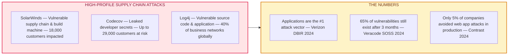

**Aligning with Industry Standards:**

| Framework | Scope | Relevance |
|-----------|-------|-----------|
| **NIST SSDF** | Secure Software Development Framework | U.S. federal and private sector baseline |
| **SLSA** | Supply-chain Levels for Software Artifacts | Build integrity and provenance verification |
| **Cyber Resilience Act (CRA)** | EU legislation on software security | Mandatory for EU market software products |
| **OpenSSF Scorecard** | Open-source security posture scoring | Automated dependency risk evaluation |

### 1.2 The Economics of Shifting Left

The cost of fixing a security defect grows exponentially as it moves through the SDLC:

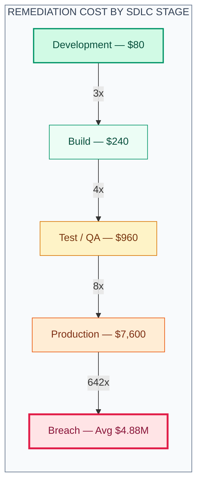

| Metric | Value | Source |
|--------|-------|--------|
| **Cost multiplier** | ~100× more expensive to fix in production vs. development | NIST & IBM Systems Sciences Institute |
| **Exploitation growth** | 180% growth in vulnerability exploitation as initial breach access | Verizon DBIR 2024 |
| **Release pressure** | 79% say DevOps teams face increasing pressure to shorten cycles | Contrast Security 2024 |
| **Security debt** | 70.8% of organizations have security debt; 89.4% is in first-party code | Veracode SOSS 2024 |

> **Sources:** NIST, Ponemon Institute, IBM Cost of a Data Breach 2024, Veracode State of Software Security 2024

### 1.3 From DevOps to Agentic DevSecOps

The industry is undergoing a four-stage evolution:

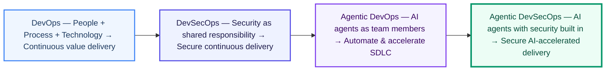

**Three Barriers to DevSecOps Adoption:**

1. **Organization & team gaps** — Security teams isolated from engineering
2. **Skill & knowledge gaps** — Developers lack security expertise
3. **Tooling friction** — Security solutions aren't built for developer workflows

**Agentic DevSecOps solves all three** by embedding AI-powered security agents directly into the developer workflow — agents that detect, explain, fix, and educate in real-time.

### 1.4 Shared Security Responsibilities

Successful DevSecOps requires a cultural shift where **every developer is accountable** for security, supported by centralized security teams and communities of practice:

```
Enterprise Security Structure:
├── Centralized Security Team (Security Researchers, Admins, Testing Lab)
├── Industry Security Research (External advisory, CVE databases)
├── Security Community of Practice (Organization-level champions)
└── Every Developer Is Accountable (Service/Application team-level)
    ├── Development Team A
    ├── Development Team B
    └── Development Team C ...
```

**Key Requirements for Success:**
- **Prevent** new security vulnerabilities from being introduced into your codebase
- **Reduce** existing vulnerabilities by remediating security debt at scale
- Cover all surfaces: **Custom Code, Secrets/Credentials, Dependencies, Infrastructure**

---

## 2. GitHub Advanced Security (GHAS) — Deep Dive

> GitHub is the world's largest developer platform with **~150 million developers**. GHAS brings native, first-party security directly into this platform — not bolted on, but built in. The mission: **shift the burden from your team to your tools**.

### 2.1 Product Structure (Post April 2025)

Announced **March 4, 2025** and generally available **April 1, 2025**, GitHub restructured GHAS into two standalone products, expanding access to GitHub Team plan customers:

| Product | What's Included | Price |
|---------|----------------|-------|
| **GitHub Secret Protection** | Secret scanning, push protection, AI-powered generic detection, custom patterns, delegated bypass, validity checks | $19/month per active committer |
| **GitHub Code Security** | CodeQL code scanning, Copilot Autofix, Dependabot, security campaigns, third-party SARIF integration | $30/month per active committer |

> **Key Change:** Previously bundled as a single GHAS license available only on Enterprise plans, these are now independently purchasable on both GitHub Team and Enterprise Cloud plans via pay-as-you-go metered billing.
>
> **GHES Note:** On GitHub Enterprise Server, GHAS continues as a bundled add-on to the Enterprise license and was not restructured into the standalone Secret Protection / Code Security products. The per-committer split applies only to GHEC and Team plans.
>
> **Reference:** [GitHub Blog — Introducing GitHub Secret Protection and GitHub Code Security](https://github.blog/changelog/2025-03-04-introducing-github-secret-protection-and-github-code-security/)

### 2.2 Prevent: Secret Protection & Push Protection

> 💡 **Stolen or leaked credentials remain the #1 initial attack vector** in data breaches, responsible for the largest share of incidents year over year. — *IBM Cost of a Data Breach 2021 & 2023*

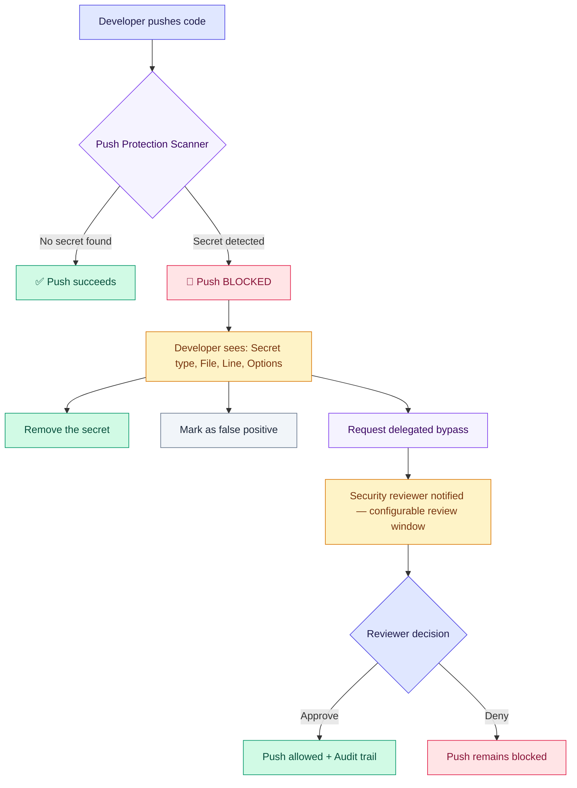

**Detection Capabilities:**

| Capability | Description |
|-----------|-------------|
| **Partner Patterns** | 200+ partner patterns covering 400+ token types from cloud providers, SaaS platforms, and package registries |
| **Copilot Secret Scanning** | AI/ML-powered detection of unstructured secrets — passwords, connection strings, generic credentials |
| **Custom Patterns** | Organization-defined regex for internal secret formats (e.g., internal API keys) |
| **Validity Checks** | Automated verification with partner APIs to confirm if a detected secret is still active |
| **Push Protection** | Server-side real-time blocking *before* secrets reach the repository |
| **Delegated Bypass** | Governance workflow requiring security team approval for exceptions |
| **Free Secret Risk Assessment** | Point-in-time scan of all repos (including private/internal/archived) — no license required |

> **Why Push Protection > Pre-commit Hooks:** Unlike pre-commit hooks that require manual configuration, can be bypassed, and provide no organizational visibility, Push Protection is server-side, automatic, and provides a full audit trail.
>
> **Reference:** [GitHub Docs — About Secret Scanning](https://docs.github.com/en/code-security/secret-scanning/introduction/about-secret-scanning)

### 2.3 Detect: Code Scanning with CodeQL

CodeQL is GitHub's **semantic code analysis engine** — it treats code as data by building a relational database from source code and running security queries in the QL language.

**Supported Languages:**

| Language | Build Mode | Notes |
|----------|-----------|-------|
| C/C++ | `autobuild` or manual | Requires compilation |
| C# | `autobuild` or manual | .NET framework support |
| Go | `autobuild` | Automatic |
| Java/Kotlin | `autobuild` or manual | Maven/Gradle support |
| JavaScript/TypeScript | No build required | — |
| Python | No build required | — |
| Ruby | No build required | — |
| Swift | `autobuild` or manual | macOS runners required |
| Rust | `autobuild` | Rust editions 2021 and 2024 |
| GitHub Actions | No build required | Scans workflow YAML for injection and security issues |

**Analysis Modes:**

| Mode | Description | Best For |
|------|-------------|----------|
| **Default Setup** | Zero-config, GitHub manages everything — scans on push, PR, and weekly schedule | Most repositories |
| **Advanced Setup** | Full control via workflow YAML — custom query suites, path filters, matrix builds | Security-focused teams |
| **CodeQL CLI** | Command-line tool for CI/CD integration beyond GitHub Actions | Non-GitHub CI systems |

**Query Suites:**

| Suite | Description | Use Case |
|-------|-------------|----------|
| `code-scanning` | Default balanced queries | Standard CI/CD |
| `security-extended` | More security queries, broader coverage | Security-focused teams |
| `security-and-quality` | Security + code quality queries | Comprehensive analysis |

> **Reference:** [GitHub Docs — About CodeQL](https://docs.github.com/en/code-security/code-scanning/introduction-to-code-scanning/about-code-scanning-with-codeql)

### 2.4 Fix: Copilot Autofix — AI-Powered Remediation

Copilot Autofix is GitHub's AI-powered vulnerability remediation engine that generates code fixes directly in pull requests and for existing security debt.

```mermaid
flowchart LR
    A["CodeQL Alert Generated"] --> B["Autofix Engine — LLM + CodeQL Semantic Context"]
    B --> C["Analyze: CWE, data flow, affected code"]
    C --> D["Generate: Code fix with explanation"]
    D --> E["Validate: Ensure fix doesn't break other queries"]
    E --> F["PR Comment — Explanation + Code diff + One-click apply"]

    style A fill:#ffe4e6,stroke:#e11d48,color:#881337
    style B fill:#f5f3ff,stroke:#7c3aed,color:#3b0764
    style C fill:#f1f5f9,stroke:#64748b,color:#1e293b
    style D fill:#f1f5f9,stroke:#64748b,color:#1e293b
    style E fill:#f1f5f9,stroke:#64748b,color:#1e293b
    style F fill:#d1fae5,stroke:#059669,stroke-width:2px,color:#064e3b
```

**Speed Impact (Source: GitHub — "Found means fixed"):**

| Vulnerability | With Autofix | Manual | Speed-up |
|---------------|-------------|--------|----------|
| **All alerts (avg)** | 28 min | 1.5 hr | **3×** |
| **Cross-site Scripting** | 22 min | 2.8 hr | **7×** |
| **SQL Injection** | 18 min | 3.7 hr | **12×** |

**Key Capabilities:**
- Covers **90%+ of alert types** across all major CodeQL-supported languages (originally launched for JavaScript, TypeScript, Java, and Python; expanded to include C#, C/C++, Go, Ruby, and Swift)
- Remediates **two-thirds of vulnerabilities** with little or no editing
- Now also generates fix suggestions for **third-party SARIF findings** — not just CodeQL
- Available for both **new PR alerts** and **existing security debt** (via Security Campaigns)

> **Reference:** [GitHub Blog — Found means fixed: Introducing code scanning autofix](https://github.blog/security/vulnerability-research/found-means-fixed-introducing-code-scanning-autofix-powered-by-github-copilot-and-codeql/)

### 2.5 Scale: Security Campaigns & Debt Reduction

Security campaigns enable **organization-wide remediation** of security debt at scale:

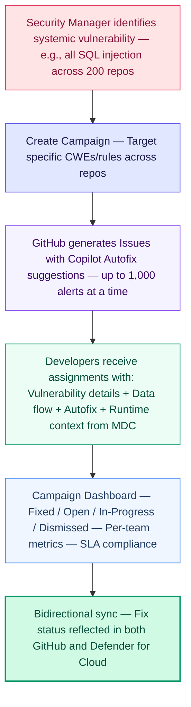

**Security Debt is Pervasive (Veracode SOSS 2024):**

| Metric | Value |
|--------|-------|
| Organizations with security debt | **70.8%** |
| Security debt in first-party code | **89.4%** |
| Median organization flaws that become debt | **46.6%** |

> **Reference:** [GitHub Community — GHAS Code Security Series](https://github.com/orgs/community/discussions/177178)

### 2.6 Protect: Supply Chain Security

| Feature | Function | Automation Level |
|---------|----------|-----------------|
| **Dependency Graph** | Maps all direct + transitive dependencies | Automatic |
| **Dependabot Alerts** | Matches against GitHub Advisory Database | Automatic |
| **Dependabot Security Updates** | Creates PRs to update vulnerable dependencies | Semi-automatic |
| **Dependabot Version Updates** | Keeps dependencies current on schedule | Configurable |
| **Dependency Review** | PR gate to prevent adding new vulnerabilities | Automatic |
| **Artifact Attestations** | Build provenance and integrity verification (SLSA) | Workflow |
| **SBOM Generation** | Software Bill of Materials for compliance | Workflow |

---

## 3. Secure Across the Stack — GHAS + MDC

### 3.1 Microsoft Defender for Cloud — DevOps Security

Microsoft Defender for Cloud provides a **centralized security console** that unifies visibility across DevOps environments:

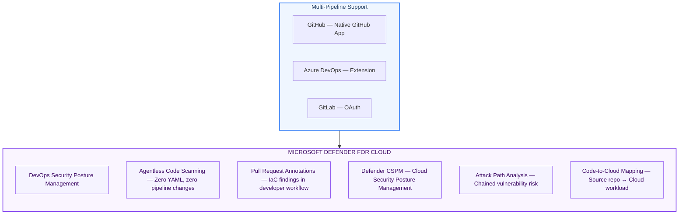

**Agentless Code Scanning Scanners:**

| Scanner | Target | Language/Framework |
|---------|--------|--------------------|
| Bandit | Application code | Python |
| ESLint (security rules) | Application code | JavaScript/TypeScript |
| Checkov | IaC | Terraform, Kubernetes, Dockerfile, ARM, Bicep, CloudFormation |
| Template Analyzer | IaC | ARM, Bicep |
| Trivy | Dependencies | OS packages and repo manifests (npm, pip, Maven, NuGet, Go modules, Cargo) |
| Syft | SBOM | Generates queryable dependency inventory across 30+ ecosystems |

> **Key advantage:** Agentless scanning requires **zero YAML changes** in any repository — scanning begins automatically once the connector is configured.
>
> **Reference:** [Microsoft Learn — Defender for Cloud DevOps Security](https://learn.microsoft.com/en-us/azure/defender-for-cloud/defender-for-devops-introduction)

### 3.2 Code-to-Cloud Mapping & Attack Path Analysis

Defender CSPM provides **contextual attack path analysis** that chains vulnerabilities from source code to runtime:

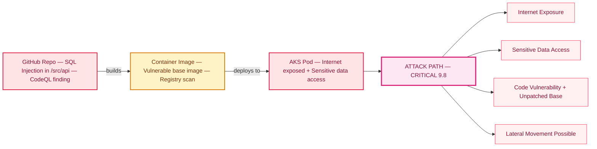

**Mapping Dimensions:**

| Dimension | Description |
|-----------|-------------|
| **Repository → Workload** | Which code repo deploys to which cloud resource |
| **Build Artifact → Runtime** | Container images traced from Dockerfile to running pods |
| **CVE → Runtime Exposure** | Code vulnerabilities linked to runtime risk context |
| **Developer → Fix Owner** | Commit history identifies who should remediate |

> **Reference:** [Microsoft Learn — Attack Path Analysis](https://learn.microsoft.com/en-us/azure/defender-for-cloud/concept-attack-path)

### 3.3 GHAS + MDC Integration Architecture

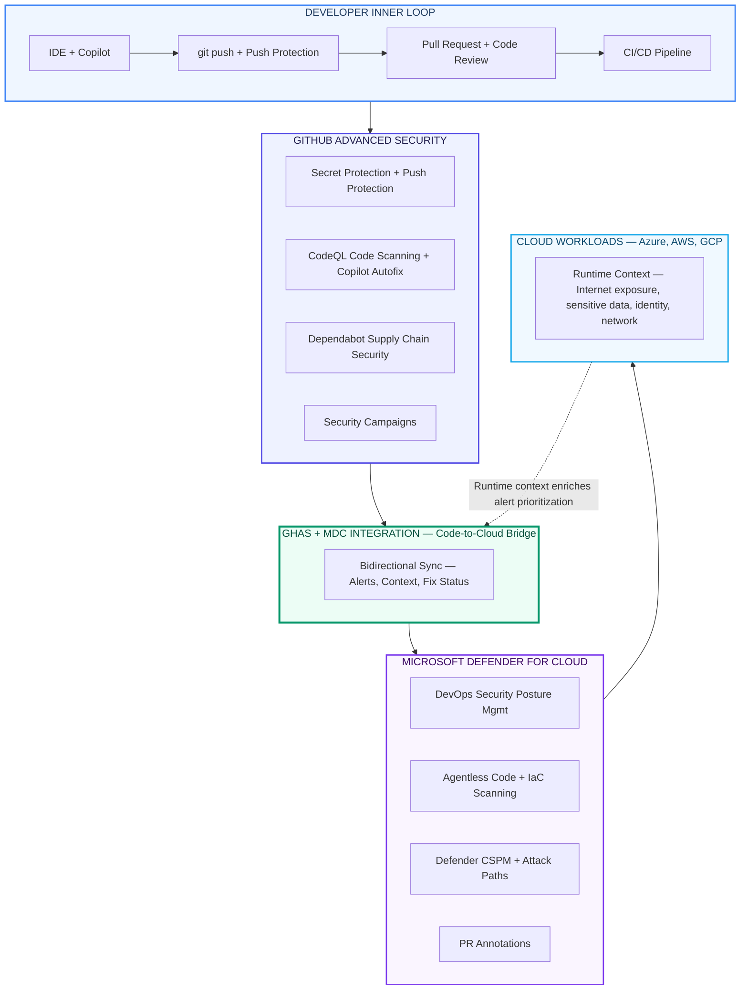

**Integration Points:**

| Layer | Technology | Function |
|-------|-----------|----------|
| Source Code | GHAS Secret Protection | Pre-commit & push-time secret detection |
| Pull Request | GHAS Code Security + MDC PR Annotations | CodeQL SAST + IaC scanning with cloud context |
| CI/CD Pipeline | CodeQL Actions + MDC Agentless Scanning | Automated vulnerability detection |
| Cloud Runtime | Defender CSPM | Runtime risk context, attack path analysis |
| Remediation | Copilot Autofix + Security Campaigns | AI-driven fix suggestions with cloud context |

### 3.4 Production-Aware Alert Prioritization

GHAS findings are enriched with MDC runtime risk factors:

| Risk Factor | Source | Impact on Priority |
|-------------|--------|-------------------|
| **Internet Exposure** | MDC Network Analysis | +Critical if public-facing |
| **Sensitive Data Access** | MDC Data Classification | +High if PII/financial data |
| **Critical Resource** | MDC Resource Tags | +High if production workload |
| **Lateral Movement** | MDC Attack Path Analysis | +Critical if pivot point |
| **Identity Risk** | MDC Identity Analysis | +High if over-permissioned |

**Unified Remediation Workflow:**

```
1. GHAS detects vulnerability (CodeQL / Secret / Dependabot)
       ↓
2. MDC enriches with runtime context (exposure, sensitive data, attack paths)
       ↓
3. Security Manager sees prioritized view in MDC → clicks "View on GitHub"
       ↓
4. GitHub Issue created with runtime risk context + affected workloads
       ↓
5. Developer uses Copilot Autofix / Coding Agent for AI-powered fix
       ↓
6. PR created → CodeQL re-scans → Fix verified
       ↓
7. Bidirectional sync: GitHub (Issue closed) ↔ MDC (Recommendation resolved)
```

**Licensing Requirements:**

| Feature | Required License |
|---------|-----------------|
| GHAS Code Scanning (CodeQL) | GitHub Code Security |
| GHAS Secret Scanning + Push Protection | GitHub Secret Protection |
| Copilot Autofix (PR suggestions) | GitHub Code Security (included) |
| Copilot Coding Agent | Any paid GitHub Copilot plan (Pro, Pro+, Business, Enterprise) |
| MDC DevOps Security (basic) | Defender for Cloud (Free tier) |
| MDC Agentless Scanning + PR Annotations | Defender CSPM |
| MDC Attack Path Analysis | Defender CSPM |
| GHAS + MDC Native Integration | GitHub Code Security + Defender CSPM |

> **Reference:** [Microsoft Learn — GHAS Integration with MDC](https://learn.microsoft.com/en-us/azure/defender-for-cloud/github-advanced-security-overview)

---

## 4. Agentic AI for DevSecOps

### 4.1 The Agentic Evolution

> 📊 **Developers spend only ~20% of their time writing code.** The other 80% goes to planning, securing, governing, and maintaining. Agentic AI reclaims that 80% by embedding autonomous agents across the entire lifecycle.

Building with agents scales the skills of every developer across three dimensions:

| Dimension | Without Agents | With Agents |
|-----------|---------------|-------------|
| **Competence** — What they know | Limited to individual expertise | AI provides security knowledge on-demand |
| **Capability** — What they can do | Constrained by tooling familiarity | Agents detect, explain, fix, and validate |
| **Capacity** — How much they can do | Bounded by human hours | Agents work in parallel, asynchronously |

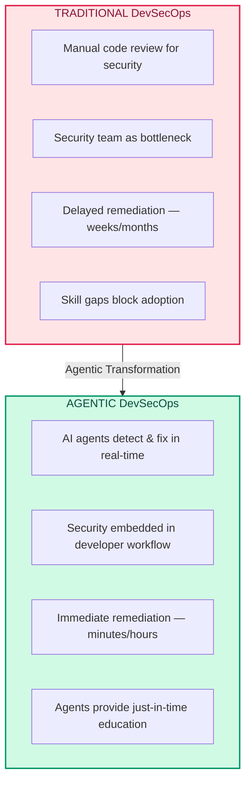

### 4.2 GitHub Copilot Coding Agent

The Copilot coding agent has been **generally available since May 19, 2025** for all paid Copilot subscribers. It operates as an autonomous team member that can be assigned issues and produces fully tested pull requests.

**How It Works:**

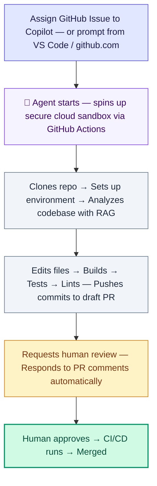

**Built-in Security Policies:**

| Policy | Protection |
|--------|-----------|
| **Branch restrictions** | Agent can only push to branches it created |
| **Review enforcement** | Requester cannot approve the agent's PR |
| **Network isolation** | Internet access limited to trusted destinations (customizable) |
| **CI/CD gating** | Actions workflows require human approval before running |
| **Existing rules apply** | Repository rulesets and org policies fully enforced |

**Capabilities:** Implementing features, fixing bugs, addressing technical debt, improving test coverage, updating documentation — excels at low-to-medium complexity tasks in well-tested codebases. Supports **Model Context Protocol (MCP)** for accessing external data sources and tools, and can process images (screenshots, mockups) included in GitHub Issues.

> **Reference:** [GitHub Blog — GitHub Copilot: Meet the new coding agent](https://github.blog/news-insights/product-news/github-copilot-meet-the-new-coding-agent/)

### 4.2.1 GitHub Copilot as a Security Prevention Layer

Beyond the coding agent, GitHub Copilot in the IDE serves as a **proactive security prevention layer** across the development lifecycle:

| Capability | How AI Helps Security |
|-----------|----------------------|
| **PREVENT** | Copilot suggests secure coding patterns, avoids known CWE patterns, and uses secure-by-default APIs during code generation |
| **FIX** | Copilot Autofix provides immediate AI-powered fix suggestions at PR time — jump-starting remediation in seconds |
| **LEARN** | Just-in-time security education — Copilot explains *why* code is vulnerable, *how* to fix it, and *how* to prevent similar issues |

**Agents across the entire software lifecycle:**

| Agent | Purpose |
|-------|---------|
| **Coding Agent** | Assign tasks to Copilot — now with security and quality built in |
| **Code Review** | Have Copilot review code, then hand updates to coding agent |
| **Code Quality** | More maintainable, reliable code and test coverage |
| **App Modernization** | Modernize Java and .NET apps securely |
| **SRE Agent** | Automate operations, reduce toil |
| **Custom Agents** | Specialized agents for recurring security tasks |

> **Reference:** [GitHub Blog — GitHub Copilot: Meet the new coding agent](https://github.blog/news-insights/product-news/github-copilot-meet-the-new-coding-agent/)

### 4.3 Custom Security Agents

Custom agents are specialized versions of the GitHub Copilot coding agent tailored to specific security workflows. These run in VS Code and as coding agents on GitHub:

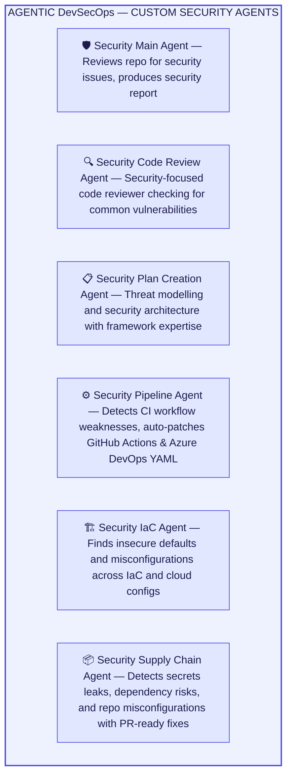

**Two Modes of Operation:**

| Mode | When | How |
|------|------|-----|
| **Pre-commit (VS Code)** | Before code leaves the developer's machine | Run agents locally to learn, fix, and validate before committing |
| **Post-commit (Coding Agent)** | After issues are filed or during campaigns | Assign security issues to Copilot for autonomous remediation |

> **Reference:** [GitHub Docs — About Custom Agents](https://docs.github.com/en/copilot/concepts/agents/coding-agent/about-custom-agents)

### 4.4 End-to-End Agentic DevSecOps Architecture

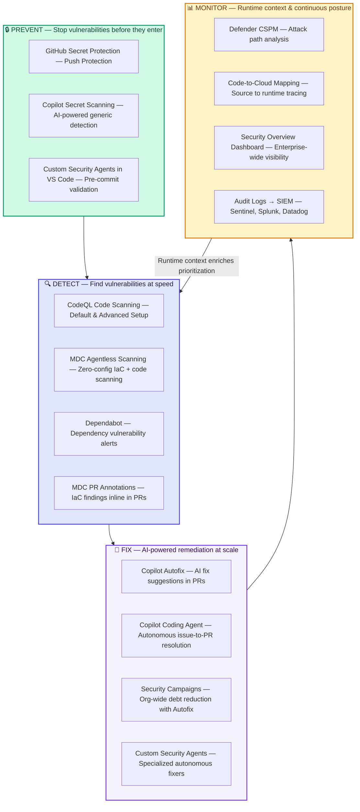

---

## 5. DevSecOps Blueprint — Guidelines & Tooling Matrix

The complete DevSecOps tooling matrix across the SDLC:

| Category | Guideline | Tools & Capabilities | Automation |
|----------|-----------|---------------------|------------|
| **Secrets Scanning** | Detect and prevent hard-coded secrets | GitHub Secret Protection, Push Protection, Copilot Secret Scanning, Custom Patterns | Automatic |
| **SCA** (Software Composition Analysis) | Manage dependency risks | Dependabot, Dependency Review, Artifact Attestations, SBOM (Anchore Syft / Microsoft), OpenSSF Scorecard, SLSA v1.0 Build L2/L3 | Workflow / Auto |
| **SAST** (Static Application Security Testing) | Detect code vulnerabilities | CodeQL (Default & Advanced), Copilot Autofix, 3rd Party SARIF Integration | Workflow / Auto |
| **IaC Scanning** | Secure infrastructure configurations | Microsoft Security DevOps (MSDO): Checkov, Template Analyzer, Terrascan, Trivy | Workflow |
| **CIS** (Container Image Scanning) | Secure container supply chain | MSDO: Checkov, Terrascan, Trivy, Anchore Grype | Workflow |
| **DAST** (Dynamic Application Security Testing) | Test running applications | OWASP ZAP (maintained by Checkmarx) | Workflow |
| **Continuous Scanning** | Runtime posture monitoring | Microsoft Defender for Cloud, Microsoft Sentinel, Azure Policy | Workflow / Auto |
| **Compliance** | Governance & audit | GHAS Security Configurations (Policy-as-Code), Delegated Bypass, Enterprise Audit Logs | Enforced |

**Shift-Left Security Maturity Model:**

| Level | Practice | Tools |
|-------|----------|-------|
| **L1 — Reactive** | Manual security reviews | Ad-hoc scanning |
| **L2 — Automated** | CI/CD-integrated scanning | CodeQL default setup, Dependabot alerts |
| **L3 — Proactive** | Push protection, PR gates | Secret scanning push protection, CodeQL PR checks |
| **L4 — Contextual** | Runtime-aware prioritization | GHAS + MDC integration, attack path analysis |
| **L5 — Agentic** | AI-powered autonomous detection, fix & campaign | Copilot Autofix, Coding Agent, Security Campaigns, Custom Agents |

**Recommended Rollout:**

```mermaid
graph LR
    subgraph P1["Phase 1 — Foundation"]
        A1["Enable GHAS on all repos"]
        A2["Connect GitHub to MDC"]
        A3["Enable secret scanning + push protection"]
        A4["Configure Dependabot"]
    end

    subgraph P2["Phase 2 — Hardening"]
        B1["Advanced CodeQL for critical repos"]
        B2["Agentless scanning in MDC"]
        B3["PR annotations + delegated bypass"]
        B4["MSDO workflow integration"]
    end

    subgraph P3["Phase 3 — Intelligence"]
        C1["GHAS + MDC native integration"]
        C2["Attack path analysis"]
        C3["Security campaigns"]
        C4["Copilot Autofix on all repos"]
    end

    subgraph P4["Phase 4 — Agentic"]
        D1["Copilot Coding Agent for security issues"]
        D2["Custom security agents"]
        D3["Audit logs to SIEM"]
        D4["Track debt reduction KPIs"]
    end

    P1 --> P2 --> P3 --> P4

    style P1 fill:#eff6ff,stroke:#3b82f6,stroke-width:2px,color:#1e3a5f
    style P2 fill:#ecfdf5,stroke:#059669,stroke-width:2px,color:#064e3b
    style P3 fill:#faf5ff,stroke:#7c3aed,stroke-width:2px,color:#3b0764
    style P4 fill:#fff7ed,stroke:#ea580c,stroke-width:2px,color:#7c2d12
```

---

## 6. Key Takeaways & Call to Action

### Key Takeaways

| # | Takeaway |
|---|---------|
| 1 | **Agentic DevSecOps is essential** for building secure AI apps and agents at scale |
| 2 | **GHAS + GHCP + MDC** together provide a comprehensive code-to-cloud security fabric |
| 3 | **AI-powered remediation** with Copilot Autofix and the Coding Agent reduces manual effort by 3–12× |
| 4 | **Scalable end-to-end DevSecOps blueprint** operationalizes application security while maintaining development velocity |
| 5 | **Reusable patterns and guidelines** integrate GHAS into your SDLC to detect secrets, dependencies, and code vulnerabilities automatically |

### Your Next Steps

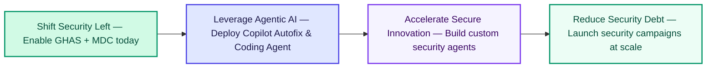

> **Which DevSecOps agents will you be creating?**

### Demo Repository

🔗 **[githubabcs-devops/gh-advsec-devsecops](https://github.com/githubabcs-devops/gh-advsec-devsecops)** — Agentic DevSecOps in Action

### Demo: What Was Demonstrated

| # | Scenario | Tools in Action |
|---|----------|----------------|
| 1 | **Secret detected & blocked** — Push protection preventing a GitHub PAT from being committed | GitHub Secret Protection, Push Protection |
| 2 | **Copilot Autofix in action** — SQL injection vulnerability fixed in <30 seconds with one-click apply | CodeQL, Copilot Autofix |
| 3 | **Custom security agent** — Security IaC Agent finding misconfigured Kubernetes RBAC | Custom Agents, VS Code |
| 4 | **Security campaign dashboard** — Security manager launching org-wide XSS remediation | Security Campaigns, Copilot Autofix |
| 5 | **MDC code-to-cloud** — Tracing a code vulnerability to its internet-exposed runtime workload | Defender CSPM, Attack Path Analysis |

---

## 7. References

### GitHub Documentation

| Resource | URL |
|----------|-----|
| About GitHub Advanced Security | https://docs.github.com/en/get-started/learning-about-github/about-github-advanced-security |
| GHAS Product Restructure (March 2025) | https://github.blog/changelog/2025-03-04-introducing-github-secret-protection-and-github-code-security/ |
| CodeQL Documentation | https://codeql.github.com/docs/ |
| Secret Scanning Documentation | https://docs.github.com/en/code-security/secret-scanning |
| Copilot Autofix — Found Means Fixed | https://github.blog/security/vulnerability-research/found-means-fixed-introducing-code-scanning-autofix-powered-by-github-copilot-and-codeql/ |
| Copilot Coding Agent (GA) | https://github.blog/news-insights/product-news/github-copilot-meet-the-new-coding-agent/ |
| Copilot Agent Awakens (Feb 2025) | https://github.blog/news-insights/product-news/github-copilot-the-agent-awakens/ |
| About Custom Agents | https://docs.github.com/en/copilot/concepts/agents/coding-agent/about-custom-agents |
| GitHub REST API — Code Scanning | https://docs.github.com/en/rest/code-scanning |
| GitHub REST API — Secret Scanning | https://docs.github.com/en/rest/secret-scanning |
| GitHub Well-Architected — Security Overview | https://github.com/well-architected |
| GHAS SIEM Integrations | https://github.blog/security/application-security/introducing-github-advanced-security-siem-integrations-for-security-professionals/ |
| Application Security Orchestration with GHAS | https://github.blog/security/application-security/application-security-orchestration-with-github-advanced-security/ |
| About Artifact Attestations and SLSA | https://docs.github.com/en/actions/security-for-github-actions/using-artifact-attestations/using-artifact-attestations-and-reusable-workflows-to-achieve-slsa-v1-build-level-3 |

### Microsoft Documentation

| Resource | URL |
|----------|-----|
| Defender for Cloud DevOps Security Overview | https://learn.microsoft.com/en-us/azure/defender-for-cloud/defender-for-devops-introduction |
| GHAS Integration with MDC | https://learn.microsoft.com/en-us/azure/defender-for-cloud/github-advanced-security-overview |
| Connect GitHub to Defender for Cloud | https://learn.microsoft.com/en-us/azure/defender-for-cloud/quickstart-onboard-github |
| Agentless Code Scanning | https://learn.microsoft.com/en-us/azure/defender-for-cloud/agentless-code-scanning |
| Pull Request Annotations | https://learn.microsoft.com/en-us/azure/defender-for-cloud/enable-pull-request-annotations |
| Attack Path Analysis | https://learn.microsoft.com/en-us/azure/defender-for-cloud/concept-attack-path |
| DevOps Security Posture Management | https://learn.microsoft.com/en-us/azure/defender-for-cloud/concept-devops-posture-management-overview |
| DevSecOps on AKS — Azure Architecture Center | https://learn.microsoft.com/en-us/azure/architecture/guide/devsecops/devsecops-on-aks |
| Secure Developer Environments for Zero Trust | https://learn.microsoft.com/en-us/security/zero-trust/develop/secure-dev-environment |

### Industry Reports & Standards

| Resource | URL / Source |
|----------|-------------|
| Verizon Data Breach Investigations Report 2024 | https://www.verizon.com/business/resources/reports/dbir/ |
| IBM Cost of a Data Breach Report 2024 | https://www.ibm.com/reports/data-breach |
| Veracode State of Software Security 2024 | https://www.veracode.com/state-software-security-report |
| Contrast Security State of DevSecOps 2024 | https://www.contrastsecurity.com/state-of-devsecops |
| NIST Secure Software Development Framework | https://csrc.nist.gov/Projects/ssdf |
| SLSA Framework | https://slsa.dev/ |

---

> **Disclaimer:** Some features described (e.g., GHAS + MDC native integration for container workloads) may be in **preview** as of April 2026. Feature availability, pricing, and capabilities may change. Always verify with official documentation.

---

*Prepared for Developer Productivity — GitHub Technical Insiders Community Call | April 2, 2026*
*Calin Lupas & Emmanuel Knafo — Sr. Cloud Solution Architects, DevSecOps Advisors, Microsoft Canada*