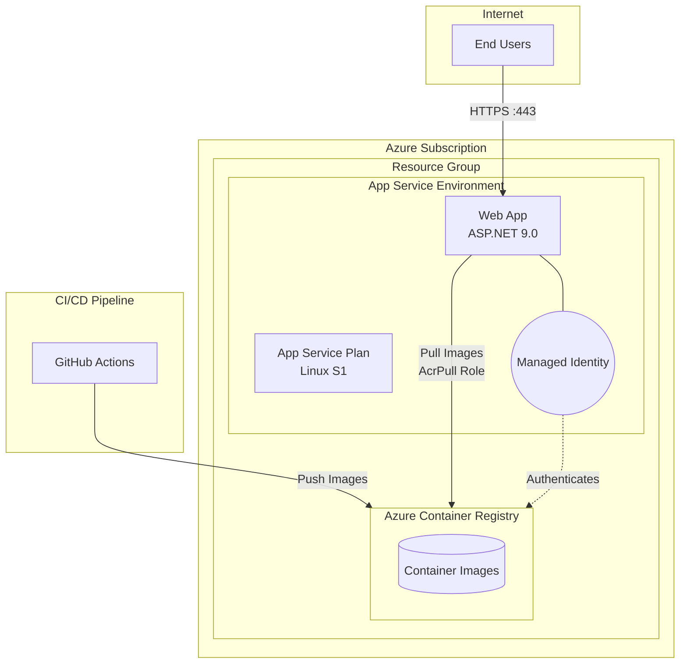
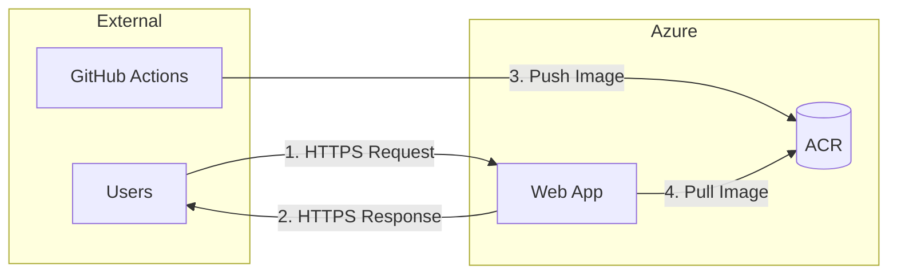

# Security Plan: gh-aspnet-webapp Blueprint

## Document Information

| Field | Value |
|-------|-------|
| Blueprint | gh-aspnet-webapp |
| Version | 1.0 |
| Date | January 29, 2026 |
| Status | Final |

## Executive Summary

This security plan addresses the containerized ASP.NET web application deployed to Azure App Service using Azure Container Registry with managed identity authentication. The architecture follows a cloud-native container deployment pattern with emphasis on credential-less authentication.

**Key Strengths:**
- Managed identity eliminates stored credentials
- AcrPull role follows least-privilege principle
- Admin user disabled on ACR

**Priority Remediation Areas:**
1. Container image security (signing, scanning)
2. Application security headers
3. Supply chain security (dependency scanning, SBOM)

---

## Architecture Overview

### System Components

| Component | Azure Resource | Security Role |
|-----------|---------------|---------------|
| Container Registry | Azure Container Registry (Basic) | Stores application container images |
| Compute Platform | App Service Plan (S1 Standard, Linux) | Hosts containerized workloads |
| Web Application | Azure Web App | Runs ASP.NET 9.0 application |
| Identity | System-Assigned Managed Identity | Enables credential-less ACR access |
| Access Control | RBAC (AcrPull) | Least-privilege image pull permissions |

### Architecture Diagram



---

## Data Flow Diagrams

### Data Flow Diagram



### Data Flow Attributes

| Flow # | Source | Destination | Protocol | Data Classification | Authentication |
|--------|--------|-------------|----------|---------------------|----------------|
| 1 | End Users | Web App | HTTPS/TLS 1.2+ | Public/Confidential | None (public app) or App-level |
| 2 | Web App | End Users | HTTPS/TLS 1.2+ | Public/Confidential | N/A |
| 3 | GitHub Actions | ACR | HTTPS/TLS 1.2+ | Internal | OIDC Federation |
| 4 | Web App | ACR | HTTPS/TLS 1.2+ | Internal | Managed Identity |

### Trust Boundaries

| Boundary | Components Inside | Components Outside | Controls |
|----------|-------------------|-------------------|----------|
| Azure Subscription | ACR, App Service, Managed Identity | Users, GitHub Actions | Azure RBAC, Network |
| Resource Group | All deployed resources | Other Azure resources | Resource-level RBAC |
| Container Runtime | Application code | Host OS, ACR | Container isolation |

---

## Secrets Inventory

| Secret | Storage Location | Rotation Policy | Access Method |
|--------|-----------------|-----------------|---------------|
| ACR Credentials | Not stored (managed identity) | N/A | System-assigned MI |
| GitHub OIDC Token | GitHub Actions (ephemeral) | Per-workflow | Federated credential |
| AZURE_CLIENT_ID | GitHub Secrets | Manual | Workflow secret |
| AZURE_TENANT_ID | GitHub Secrets | Manual | Workflow secret |
| AZURE_SUBSCRIPTION_ID | GitHub Secrets | Manual | Workflow secret |
| App Settings | App Service Configuration | Manual | Platform managed |

### Positive Security Note
✅ **No long-lived credentials stored** - The architecture uses managed identity and OIDC federation, eliminating stored secrets for Azure authentication.

---

## Threat Summary

| ID | Threat | Category | Severity | Likelihood | Risk |
|----|--------|----------|----------|------------|------|
| T1 | Container Image Tampering | DevOps Security (DS) | High | Medium | High |
| T2 | Unauthorized ACR Access | Privileged Access (PA) | High | Low | Medium |
| T3 | Web Application Vulnerabilities | Application Security | High | Medium | High |
| T4 | Missing Security Headers | Network Security (NS) | Medium | High | Medium |
| T5 | Container Escape | Endpoint Security (ES) | Critical | Low | Medium |
| T6 | Supply Chain Attack | DevOps Security (DS) | High | Medium | High |
| T7 | Denial of Service | Network Security (NS) | Medium | Medium | Medium |
| T8 | Information Disclosure | Data Protection (DP) | Medium | Medium | Medium |
| T9 | Insufficient Logging | Governance (GS) | Medium | High | Medium |
| T10 | Insecure App Configuration | Data Protection (DP) | Medium | Medium | Medium |

---

## Detailed Threats and Mitigations

### T1: Container Image Tampering

**Category:** DevOps Security (DS)  
**STRIDE:** Tampering  
**Affected Component:** Azure Container Registry, CI/CD Pipeline

**Description:** Malicious actors could push compromised container images to ACR or modify images in transit, leading to deployment of malicious code.

**Current Controls:**
- ✅ Managed identity authentication (no stored credentials)
- ✅ AcrPull role limits Web App to read-only
- ⚠️ No image signing configured
- ⚠️ No vulnerability scanning enabled

**Mitigations:**

| Priority | Mitigation | Implementation |
|----------|------------|----------------|
| High | Enable ACR Content Trust | `az acr config content-trust update --name <acr> --status enabled` |
| High | Enable Defender for Containers | Enable in Azure Security Center |
| Medium | Implement image signing | Use Notation or Cosign for SBOM attestation |
| Medium | Pin image digests | Use `image@sha256:...` instead of tags |

---

### T2: Unauthorized ACR Access

**Category:** Privileged Access (PA)  
**STRIDE:** Elevation of Privilege  
**Affected Component:** Azure Container Registry

**Description:** Attackers gaining ACR push access could deploy malicious containers.

**Current Controls:**
- ✅ Admin user disabled
- ✅ Managed identity with AcrPull (read-only)
- ✅ OIDC federation for CI/CD (no long-lived tokens)

**Mitigations:**

| Priority | Mitigation | Implementation |
|----------|------------|----------------|
| High | Enable ACR firewall | Restrict to GitHub Actions IPs and App Service VNet |
| Medium | Enable audit logging | `az monitor diagnostic-settings create` for ACR |
| Low | Use Premium SKU for private endpoints | Upgrade ACR SKU if needed |

---

### T3: Web Application Vulnerabilities

**Category:** Application Security  
**STRIDE:** Multiple  
**Affected Component:** ASP.NET Web App

**Description:** Common web vulnerabilities (XSS, injection, CSRF) in the application code.

**Current Controls:**
- ✅ ASP.NET built-in protections
- ⚠️ No explicit CSRF validation configured
- ⚠️ No security headers middleware

**Mitigations:**

| Priority | Mitigation | Implementation |
|----------|------------|----------------|
| High | Add security headers middleware | Configure in Program.cs |
| High | Enable anti-forgery tokens | Add `[ValidateAntiForgeryToken]` |
| High | Implement input validation | Use model validation attributes |
| Medium | Enable SAST in CI/CD | Add CodeQL or similar scanning |

---

### T4: Missing Security Headers

**Category:** Network Security (NS)  
**STRIDE:** Information Disclosure  
**Affected Component:** Web App HTTP responses

**Description:** Missing headers expose application to clickjacking, MIME-sniffing, and XSS attacks.

**Current Controls:**
- ✅ HSTS enabled (default 30 days)
- ⚠️ No CSP header
- ⚠️ No X-Frame-Options
- ⚠️ No X-Content-Type-Options

**Mitigations:**

| Priority | Mitigation | Implementation |
|----------|------------|----------------|
| High | Add security headers | See code snippet below |

```csharp
// Add to Program.cs after app.UseHsts()
app.Use(async (context, next) =>
{
    context.Response.Headers.Append("X-Content-Type-Options", "nosniff");
    context.Response.Headers.Append("X-Frame-Options", "DENY");
    context.Response.Headers.Append("Content-Security-Policy", "default-src 'self'");
    context.Response.Headers.Append("Referrer-Policy", "strict-origin-when-cross-origin");
    context.Response.Headers.Append("Permissions-Policy", "geolocation=(), microphone=(), camera=()");
    await next();
});
```

---

### T5: Container Escape

**Category:** Endpoint Security (ES)  
**STRIDE:** Elevation of Privilege  
**Affected Component:** Container Runtime

**Description:** Vulnerabilities allowing escape from container to host system.

**Current Controls:**
- ✅ App Service managed container runtime
- ✅ Microsoft-managed base image
- ⚠️ Container runs as root

**Mitigations:**

| Priority | Mitigation | Implementation |
|----------|------------|----------------|
| Medium | Run as non-root user | Add `USER` directive to Dockerfile |
| Medium | Keep base images updated | Pin to specific versions, update regularly |
| Low | Use distroless base image | Consider `mcr.microsoft.com/dotnet/runtime-deps` |

**Dockerfile Update:**
```dockerfile
# Add before ENTRYPOINT in final stage
RUN adduser --disabled-password --gecos '' appuser
USER appuser
```

---

### T6: Supply Chain Attack

**Category:** DevOps Security (DS)  
**STRIDE:** Tampering  
**Affected Component:** CI/CD Pipeline, Dependencies

**Description:** Compromised dependencies or build tools introducing vulnerabilities.

**Current Controls:**
- ✅ GitHub Actions with OIDC
- ⚠️ No dependency scanning
- ⚠️ No SBOM generation

**Mitigations:**

| Priority | Mitigation | Implementation |
|----------|------------|----------------|
| High | Enable Dependabot | Configure `.github/dependabot.yml` |
| High | Enable GitHub Advanced Security | SAST/SCA scanning |
| Medium | Generate SBOM attestations | Use `actions/attest-build-provenance` |
| Medium | Pin action versions | Use SHA instead of tags |

**Dependabot Configuration:**
```yaml
# .github/dependabot.yml
version: 2
updates:
  - package-ecosystem: "nuget"
    directory: "/src/webapp01"
    schedule:
      interval: "weekly"
  - package-ecosystem: "docker"
    directory: "/src/webapp01"
    schedule:
      interval: "weekly"
  - package-ecosystem: "github-actions"
    directory: "/"
    schedule:
      interval: "weekly"
```

---

### T7: Denial of Service

**Category:** Network Security (NS)  
**STRIDE:** Denial of Service  
**Affected Component:** Web App, App Service

**Description:** Attackers overwhelming the application with requests.

**Current Controls:**
- ✅ App Service built-in DDoS protection
- ⚠️ No rate limiting configured
- ⚠️ No request size limits

**Mitigations:**

| Priority | Mitigation | Implementation |
|----------|------------|----------------|
| Medium | Enable Azure Front Door | Add WAF and DDoS protection |
| Medium | Configure request limits | Set in Program.cs |
| Low | Enable auto-scaling | Configure App Service scaling rules |

---

### T8: Information Disclosure

**Category:** Data Protection (DP)  
**STRIDE:** Information Disclosure  
**Affected Component:** Web App, Error Handling

**Description:** Detailed error messages or debug information exposed to users.

**Current Controls:**
- ✅ Custom error page configured
- ⚠️ Request ID shown in error page
- ⚠️ No structured logging

**Mitigations:**

| Priority | Mitigation | Implementation |
|----------|------------|----------------|
| Medium | Remove request ID from error page | Update Error.cshtml |
| Medium | Configure Application Insights | Add telemetry without sensitive data |
| Low | Implement structured logging | Use Serilog or similar |

---

### T9: Insufficient Logging

**Category:** Governance (GS)  
**STRIDE:** Repudiation  
**Affected Component:** All components

**Description:** Lack of audit trails for security events.

**Current Controls:**
- ⚠️ No Application Insights configured
- ⚠️ No diagnostic settings for ACR
- ⚠️ No security event logging

**Mitigations:**

| Priority | Mitigation | Implementation |
|----------|------------|----------------|
| High | Enable Application Insights | Add to Bicep and Program.cs |
| High | Enable ACR diagnostic logs | Configure diagnostic settings |
| Medium | Configure log retention | Set appropriate retention policies |

---

### T10: Insecure App Configuration

**Category:** Data Protection (DP)  
**STRIDE:** Information Disclosure  
**Affected Component:** App Service Configuration

**Description:** Sensitive configuration exposed or misconfigured.

**Current Controls:**
- ✅ App settings stored in App Service
- ⚠️ No Key Vault integration
- ⚠️ Configuration not encrypted at rest

**Mitigations:**

| Priority | Mitigation | Implementation |
|----------|------------|----------------|
| Medium | Integrate Azure Key Vault | Store sensitive settings in Key Vault |
| Medium | Use Key Vault references | Reference secrets from App Settings |
| Low | Enable slot-specific settings | Prevent config leakage between slots |

---

## Implementation Checklist

### Immediate (Week 1)

- [ ] Add security headers middleware to Program.cs
- [ ] Enable Dependabot for dependency scanning
- [ ] Configure anti-forgery token validation
- [ ] Update Dockerfile to run as non-root user

### Short-term (Month 1)

- [ ] Enable Defender for Containers
- [ ] Configure ACR diagnostic logging
- [ ] Enable Application Insights
- [ ] Implement CodeQL scanning in CI/CD

### Medium-term (Quarter 1)

- [ ] Enable ACR Content Trust
- [ ] Integrate Azure Key Vault for secrets
- [ ] Configure Azure Front Door with WAF
- [ ] Implement SBOM generation and attestation

---

## Appendix: Bicep Security Enhancements

```bicep
// Add to resources.bicep for enhanced security

// Enable diagnostic settings for ACR
resource acrDiagnostics 'Microsoft.Insights/diagnosticSettings@2021-05-01-preview' = {
  name: 'acr-diagnostics'
  scope: acr
  properties: {
    logs: [
      {
        categoryGroup: 'allLogs'
        enabled: true
        retentionPolicy: {
          enabled: true
          days: 90
        }
      }
    ]
  }
}

// Add minimum TLS version to Web App
resource webAppConfig 'Microsoft.Web/sites/config@2024-04-01' = {
  parent: webApp
  name: 'web'
  properties: {
    minTlsVersion: '1.2'
    ftpsState: 'Disabled'
    http20Enabled: true
  }
}
```

---

## Document History

| Version | Date | Author | Changes |
|---------|------|--------|---------|
| 1.0 | January 29, 2026 | Security Plan Creator | Initial version |
