# Security Plan: sample-web-app

## 1. Preamble

| Attribute | Value |
| --- | --- |
| **Blueprint Name** | sample-web-app |
| **Document Version** | 1.0 |
| **Created Date** | 2026-01-28 |
| **Infrastructure Type** | Bicep |
| **Target Environment** | Azure |
| **Last Reviewed** | 2026-01-28 |

## 2. Executive Summary

This security plan covers a three-tier web application architecture deployed on Azure consisting of:

- **Azure App Service** - Web frontend with system-assigned managed identity
- **Azure SQL Database** - Persistent data storage with public access disabled
- **Azure Key Vault** - Secrets management with RBAC and network restrictions
- **Application Insights + Log Analytics** - Monitoring and telemetry

### Current Security Posture Highlights

| Control | Status |
| --- | --- |
| HTTPS-only enforcement | ✅ Implemented |
| TLS 1.2 minimum | ✅ Implemented |
| Managed identity for service auth | ✅ Implemented |
| Key Vault RBAC authorization | ✅ Implemented |
| Key Vault soft delete + purge protection | ✅ Implemented |
| SQL Server public access disabled | ✅ Implemented |
| FTPS disabled on App Service | ✅ Implemented |

### Areas Requiring Attention

| Gap | Priority | Risk |
| --- | --- | --- |
| No Web Application Firewall (WAF) | P1 | Critical |
| SQL authentication instead of Azure AD | P1 | Critical |
| No application-level authentication | P1 | High |
| No diagnostic settings for audit logging | P2 | Medium |
| App Insights keys in plain text settings | P2 | Medium |
| No virtual network integration | P2 | Medium |

---

## 3. System Architecture Diagram


## 4. Security Boundaries Diagram

```mermaid
flowchart TB
    subgraph External["External Zone (Untrusted)"]
        Users[("👤 Users")]
    end

    subgraph Edge["Edge Security"]
        direction LR
        TLS["TLS 1.2+ Termination"]
    end

    subgraph AppTier["Application Zone"]
        APP["App Service<br/>• HTTPS Only<br/>• FTPS Disabled<br/>• Always On"]
    end

    subgraph DataTier["Data Zone (Restricted)"]
        KV["Key Vault<br/>• Network ACLs: Deny<br/>• RBAC Enabled<br/>• Soft Delete: 90 days"]
        SQL["SQL Server<br/>• Public Access: Disabled<br/>• TLS 1.2"]
    end

    subgraph Identity["Identity Plane"]
        MI["Managed Identity"]
        RBAC["RBAC Role Assignment"]
    end

    Users --> TLS
    TLS --> APP
    APP -.-> MI
    MI --> RBAC
    RBAC --> KV
    APP --> SQL
```



## 5. Data Flow Diagram


---

## 6. Data Flow Attributes

| Flow # | Source | Destination | Protocol | Data Classification | Encryption | Authentication |
| --- | --- | --- | --- | --- | --- | --- |
| 1 | User | App Service | HTTPS | Public/Sensitive | TLS 1.2+ | None/App-level |
| 2 | App Service | Azure AD | HTTPS | System | TLS 1.3 | Managed Identity |
| 3 | Azure AD | App Service | HTTPS | System | TLS 1.3 | OAuth Token |
| 4 | App Service | Key Vault | HTTPS | System | TLS 1.2+ | Bearer Token (MI) |
| 5 | Key Vault | App Service | HTTPS | Confidential | TLS 1.2+ | Bearer Token (MI) |
| 6 | App Service | SQL Database | TDS | Confidential | TLS 1.2+ | SQL Auth / AAD |
| 7 | SQL Database | App Service | TDS | Confidential | TLS 1.2+ | SQL Auth / AAD |
| 8 | App Service | App Insights | HTTPS | Internal | TLS 1.2+ | Instrumentation Key |
| 9 | App Service | User | HTTPS | Public/Sensitive | TLS 1.2+ | None/App-level |

## 7. Data Classification Summary

| Classification | Description | Examples in This Architecture |
| --- | --- | --- |
| **Confidential** | Secrets, credentials, PII | SQL connection strings, API keys, user data |
| **Internal** | Operational data | Telemetry, logs, performance metrics |
| **System** | Infrastructure tokens | Managed identity tokens, RBAC assignments |
| **Public** | Non-sensitive | Static content, public pages |

---

## 8. Secrets Inventory

| Secret ID | Secret Name | Storage Location | Rotation Policy | Access Method | Consumers |
| --- | --- | --- | --- | --- | --- |
| SEC-001 | SQL Admin Password | ⚠️ Not defined in template | Manual | Direct reference | SQL Server |
| SEC-002 | SQL Connection String | Key Vault | Manual (recommended: 90 days) | Managed Identity + RBAC | App Service |
| SEC-003 | App Insights Instrumentation Key | App Settings (plain text) | N/A (static) | Environment variable | App Service |
| SEC-004 | App Insights Connection String | App Settings (plain text) | N/A (static) | Environment variable | App Service |
| SEC-005 | Key Vault URI | App Settings (plain text) | N/A (static) | Environment variable | App Service |

## 9. Secrets Risk Assessment

| Secret ID | Current Risk | Issue | Recommendation |
| --- | --- | --- | --- |
| SEC-001 | 🔴 **High** | SQL admin password not defined; likely passed as parameter or hardcoded | Use Azure AD authentication; eliminate SQL auth |
| SEC-002 | 🟢 **Low** | Stored in Key Vault with RBAC | Enable automatic rotation |
| SEC-003 | 🟡 **Medium** | Instrumentation key in plain text app settings | Use Key Vault reference syntax |
| SEC-004 | 🟡 **Medium** | Connection string in plain text app settings | Use Key Vault reference syntax |
| SEC-005 | 🟢 **Low** | Non-sensitive URI reference | No action needed |

---

## 10. Threat Summary Matrix

| Threat ID | Category | Threat | Affected Component | Likelihood | Impact | Risk Level |
| --- | --- | --- | --- | --- | --- | --- |
| T-001 | NS | DDoS Attack | App Service | Medium | High | 🟠 **High** |
| T-002 | NS | Web Application Attacks (SQLi, XSS) | App Service | High | High | 🔴 **Critical** |
| T-003 | IM | Credential Theft/Stuffing | App Service | Medium | High | 🟠 **High** |
| T-004 | PA | SQL Admin Account Compromise | SQL Server | Medium | Critical | 🔴 **Critical** |
| T-005 | DP | Data Exfiltration | SQL Database | Low | Critical | 🟠 **High** |
| T-006 | DP | Man-in-the-Middle Attack | All Data Flows | Low | High | 🟡 **Medium** |
| T-007 | PV | Unpatched Vulnerabilities | App Service, SQL | Medium | High | 🟠 **High** |
| T-008 | GS | Insufficient Logging/Monitoring | All Components | Medium | Medium | 🟡 **Medium** |
| T-009 | DS | Supply Chain Attack | App Service | Low | High | 🟡 **Medium** |
| T-010 | PA | Key Vault Unauthorized Access | Key Vault | Low | Critical | 🟠 **High** |

## 11. Threat Categories Legend

| Code | Category | Description |
| --- | --- | --- |
| NS | Network Security | WAF, firewall, network segmentation |
| IM | Identity Management | Authentication, access control |
| PA | Privileged Access | Admin accounts, emergency access |
| DP | Data Protection | Encryption, data classification |
| PV | Posture & Vulnerability | Patching, assessments |
| GS | Governance & Strategy | Logging, compliance |
| DS | DevOps Security | CI/CD, supply chain |

## 12. Mitigation Summary

| Threat ID | Current State | Recommended Mitigation | Priority | Effort |
| --- | --- | --- | --- | --- |
| T-001 | ❌ No WAF | Deploy Azure Front Door with WAF | P1 | Medium |
| T-002 | ❌ No WAF | Enable WAF with OWASP Core Rule Set 3.2 | P1 | Medium |
| T-003 | ❌ No auth defined | Implement Azure AD B2C or Easy Auth | P1 | High |
| T-004 | ⚠️ SQL Auth used | Migrate to Azure AD authentication for SQL | P1 | Medium |
| T-005 | ✅ Public access disabled | Add Advanced Threat Protection, audit logging | P2 | Low |
| T-006 | ✅ TLS 1.2 enforced | Maintain current configuration | P3 | N/A |
| T-007 | ⚠️ Manual patching | Enable auto-updates, Defender for Cloud | P2 | Low |
| T-008 | ⚠️ Basic logging | Add diagnostic settings for all resources | P2 | Low |
| T-009 | ❌ No controls | Implement dependency scanning in CI/CD | P2 | Medium |
| T-010 | ✅ RBAC + Network ACLs | Add Key Vault firewall rules, enable logging | P3 | Low |

## 13. Risk Heat Map

```text
                    IMPACT
           Low    Medium    High    Critical
         ┌───────┬─────────┬────────┬──────────┐
    High │       │         │ T-002  │          │
         ├───────┼─────────┼────────┼──────────┤
  L Med  │       │ T-008   │ T-001  │ T-004    │
  I      │       │         │ T-003  │          │
  K      │       │         │ T-007  │          │
  E      ├───────┼─────────┼────────┼──────────┤
  L Low  │       │ T-009   │ T-006  │ T-005    │
  I      │       │         │        │ T-010    │
  H      ├───────┼─────────┼────────┼──────────┤
  O Very │       │         │        │          │
  O Low  │       │         │        │          │
  D      └───────┴─────────┴────────┴──────────┘
```

## 14. Priority Action Items

| Priority | Action | Threats Addressed | Owner |
| --- | --- | --- | --- |
| **P1** | Deploy Azure Front Door with WAF | T-001, T-002 | Infrastructure |
| **P1** | Replace SQL Auth with Azure AD Auth | T-004 | Infrastructure |
| **P1** | Implement application authentication | T-003 | Development |
| **P2** | Enable Defender for Cloud | T-005, T-007 | Security |
| **P2** | Add diagnostic settings | T-008 | Infrastructure |
| **P2** | Add dependency scanning to CI/CD | T-009 | DevOps |
| **P3** | Configure Key Vault audit logging | T-010 | Security |

---

## 15. Detailed Threat Analysis

### T-001: DDoS Attack

| Attribute | Value |
| --- | --- |
| **Category** | Network Security (NS) |
| **Affected Components** | App Service |
| **Attack Vector** | Volumetric or application-layer flood attacks targeting the public endpoint |
| **Likelihood** | Medium |
| **Impact** | High - Service unavailability, revenue loss, reputation damage |
| **Risk Level** | 🟠 High |

**Current State:** App Service has basic Azure platform DDoS protection but no application-layer protection.

**Mitigation:**

```bicep
// Add Azure Front Door with WAF
resource frontDoor 'Microsoft.Cdn/profiles@2023-05-01' = {
  name: 'afd-${resourceSuffix}'
  location: 'global'
  sku: {
    name: 'Premium_AzureFrontDoor'
  }
}

resource wafPolicy 'Microsoft.Network/FrontDoorWebApplicationFirewallPolicies@2022-05-01' = {
  name: 'waf-${resourceSuffix}'
  location: 'global'
  properties: {
    policySettings: {
      enabledState: 'Enabled'
      mode: 'Prevention'
    }
    managedRules: {
      managedRuleSets: [
        {
          ruleSetType: 'Microsoft_DefaultRuleSet'
          ruleSetVersion: '2.1'
        }
      ]
    }
  }
}
```

**Validation:** Monitor Front Door metrics for blocked requests and latency.

---

### T-002: Web Application Attacks (SQLi, XSS)

| Attribute | Value |
| --- | --- |
| **Category** | Network Security (NS) |
| **Affected Components** | App Service |
| **Attack Vector** | Malicious input via forms, query strings, or headers |
| **Likelihood** | High |
| **Impact** | High - Data breach, unauthorized access, defacement |
| **Risk Level** | 🔴 Critical |

**Current State:** No WAF protection; application relies solely on code-level input validation.

**Mitigation:**

1. Deploy WAF with OWASP Core Rule Set (see T-001)
2. Enable rate limiting rules
3. Implement Content Security Policy headers

```bicep
// Add to App Service siteConfig
siteConfig: {
  // ... existing config
  http20Enabled: true
  requestTracingEnabled: true
  detailedErrorLoggingEnabled: true
}
```

**Application-level controls:**

- Use parameterized queries (Entity Framework recommended)
- Implement output encoding
- Add CSP headers in application middleware

---

### T-003: Credential Theft/Stuffing

| Attribute | Value |
| --- | --- |
| **Category** | Identity Management (IM) |
| **Affected Components** | App Service |
| **Attack Vector** | Automated login attempts using stolen credential lists |
| **Likelihood** | Medium |
| **Impact** | High - Account takeover, data access |
| **Risk Level** | 🟠 High |

**Current State:** No authentication mechanism defined in infrastructure.

**Mitigation:**

```bicep
// Enable Easy Auth with Azure AD
resource appServiceAuthSettings 'Microsoft.Web/sites/config@2023-12-01' = {
  parent: appService
  name: 'authsettingsV2'
  properties: {
    globalValidation: {
      requireAuthentication: true
      unauthenticatedClientAction: 'RedirectToLoginPage'
    }
    identityProviders: {
      azureActiveDirectory: {
        enabled: true
        registration: {
          openIdIssuer: 'https://sts.windows.net/${subscription().tenantId}/v2.0'
          clientId: '<app-registration-client-id>'
        }
        validation: {
          allowedAudiences: [
            'api://<app-registration-client-id>'
          ]
        }
      }
    }
  }
}
```

**Additional controls:**

- Implement MFA via Conditional Access
- Enable sign-in risk policies
- Configure account lockout thresholds

---

### T-004: SQL Admin Account Compromise

| Attribute | Value |
| --- | --- |
| **Category** | Privileged Access (PA) |
| **Affected Components** | SQL Server, SQL Database |
| **Attack Vector** | Password guessing, credential theft, insider threat |
| **Likelihood** | Medium |
| **Impact** | Critical - Full database access, data exfiltration |
| **Risk Level** | 🔴 Critical |

**Current State:** SQL Server configured with SQL authentication (`administratorLogin: 'sqladmin'`). Password source unknown.

**Mitigation - Replace SQL Auth with Azure AD:**

```bicep
resource sqlServer 'Microsoft.Sql/servers@2023-08-01-preview' = {
  name: sqlServerName
  location: location
  properties: {
    // Remove SQL auth
    administrators: {
      administratorType: 'ActiveDirectory'
      principalType: 'Group'
      login: 'SQL-Admins-Group'
      sid: '<azure-ad-group-object-id>'
      tenantId: subscription().tenantId
      azureADOnlyAuthentication: true
    }
    minimalTlsVersion: '1.2'
    publicNetworkAccess: 'Disabled'
  }
}
```

**Validation:** Verify `azureADOnlyAuthentication: true` is enforced.

---

### T-005: Data Exfiltration

| Attribute | Value |
| --- | --- |
| **Category** | Data Protection (DP) |
| **Affected Components** | SQL Database |
| **Attack Vector** | Compromised application, insider threat, SQL injection |
| **Likelihood** | Low |
| **Impact** | Critical - Regulatory fines, reputation damage |
| **Risk Level** | 🟠 High |

**Current State:** Public network access disabled (good). No threat detection or auditing configured.

**Mitigation:**

```bicep
// Enable Advanced Threat Protection
resource sqlServerSecurityAlertPolicy 'Microsoft.Sql/servers/securityAlertPolicies@2023-08-01-preview' = {
  parent: sqlServer
  name: 'Default'
  properties: {
    state: 'Enabled'
    emailAccountAdmins: true
  }
}

// Enable auditing
resource sqlServerAuditingSettings 'Microsoft.Sql/servers/auditingSettings@2023-08-01-preview' = {
  parent: sqlServer
  name: 'default'
  properties: {
    state: 'Enabled'
    storageEndpoint: '<storage-account-blob-endpoint>'
    storageAccountAccessKey: '<storage-account-key>'
    retentionDays: 90
  }
}
```

---

### T-006: Man-in-the-Middle Attack

| Attribute | Value |
| --- | --- |
| **Category** | Data Protection (DP) |
| **Affected Components** | All Data Flows |
| **Attack Vector** | Network interception, certificate spoofing |
| **Likelihood** | Low |
| **Impact** | High - Credential theft, data interception |
| **Risk Level** | 🟡 Medium |

**Current State:** ✅ Well mitigated

- App Service: `httpsOnly: true`, `minTlsVersion: '1.2'`, `ftpsState: 'Disabled'`
- SQL Server: `minimalTlsVersion: '1.2'`
- Key Vault: TLS 1.2 enforced by Azure platform

**Recommendation:** Maintain current configuration. Consider TLS 1.3 when fully supported.

---

### T-007: Unpatched Vulnerabilities

| Attribute | Value |
| --- | --- |
| **Category** | Posture & Vulnerability (PV) |
| **Affected Components** | App Service, SQL Server |
| **Attack Vector** | Exploitation of known CVEs |
| **Likelihood** | Medium |
| **Impact** | High - RCE, privilege escalation |
| **Risk Level** | 🟠 High |

**Current State:** Azure PaaS services receive platform updates automatically. Application dependencies not scanned.

**Mitigation:**

1. Enable Microsoft Defender for Cloud:

```bicep
resource defenderForAppService 'Microsoft.Security/pricings@2024-01-01' = {
  name: 'AppServices'
  properties: {
    pricingTier: 'Standard'
  }
}

resource defenderForSql 'Microsoft.Security/pricings@2024-01-01' = {
  name: 'SqlServers'
  properties: {
    pricingTier: 'Standard'
  }
}
```

2. Add dependency scanning to CI/CD pipeline (GitHub Advanced Security)

---

### T-008: Insufficient Logging/Monitoring

| Attribute | Value |
| --- | --- |
| **Category** | Governance & Strategy (GS) |
| **Affected Components** | All Components |
| **Attack Vector** | N/A - Detection gap |
| **Likelihood** | Medium |
| **Impact** | Medium - Delayed incident response |
| **Risk Level** | 🟡 Medium |

**Current State:** Application Insights configured for telemetry. No diagnostic settings for infrastructure resources.

**Mitigation:**

```bicep
// Add diagnostic settings for Key Vault
resource keyVaultDiagnostics 'Microsoft.Insights/diagnosticSettings@2021-05-01-preview' = {
  name: 'kv-diagnostics'
  scope: keyVault
  properties: {
    workspaceId: logAnalytics.id
    logs: [
      {
        categoryGroup: 'allLogs'
        enabled: true
      }
    ]
    metrics: [
      {
        category: 'AllMetrics'
        enabled: true
      }
    ]
  }
}

// Add diagnostic settings for App Service
resource appServiceDiagnostics 'Microsoft.Insights/diagnosticSettings@2021-05-01-preview' = {
  name: 'app-diagnostics'
  scope: appService
  properties: {
    workspaceId: logAnalytics.id
    logs: [
      {
        category: 'AppServiceHTTPLogs'
        enabled: true
      }
      {
        category: 'AppServiceAuditLogs'
        enabled: true
      }
    ]
  }
}
```

---

### T-009: Supply Chain Attack

| Attribute | Value |
| --- | --- |
| **Category** | DevOps Security (DS) |
| **Affected Components** | App Service |
| **Attack Vector** | Compromised NuGet packages, malicious dependencies |
| **Likelihood** | Low |
| **Impact** | High - Code execution, backdoors |
| **Risk Level** | 🟡 Medium |

**Current State:** No dependency scanning visible in repository.

**Mitigation:**

1. Enable GitHub Dependabot in repository
2. Enable GitHub Advanced Security for secret scanning
3. Add SAST/DAST to CI/CD pipeline

```yaml
# .github/workflows/security.yml
- name: Run dependency review
  uses: actions/dependency-review-action@v4

- name: Run CodeQL analysis
  uses: github/codeql-action/analyze@v3
```

---

### T-010: Key Vault Unauthorized Access

| Attribute | Value |
| --- | --- |
| **Category** | Privileged Access (PA) |
| **Affected Components** | Key Vault |
| **Attack Vector** | RBAC misconfiguration, token theft |
| **Likelihood** | Low |
| **Impact** | Critical - Access to all secrets |
| **Risk Level** | 🟠 High |

**Current State:** ✅ Good baseline

- RBAC authorization enabled
- Soft delete (90 days) and purge protection enabled
- Network ACLs set to deny by default

**Additional Mitigation:**

```bicep
// Tighten network ACLs with specific IPs if known
networkAcls: {
  defaultAction: 'Deny'
  bypass: 'AzureServices'
  virtualNetworkRules: [
    {
      id: '<app-service-vnet-subnet-id>'
    }
  ]
}
```

Enable audit logging (see T-008 diagnostic settings).

---

## 16. Implementation Checklist

### Priority 1 (Critical - Implement Immediately)

- [ ] Deploy Azure Front Door with WAF (T-001, T-002)
- [ ] Configure WAF with OWASP Core Rule Set 3.2
- [ ] Replace SQL authentication with Azure AD authentication (T-004)
- [ ] Implement application-level authentication via Easy Auth or Azure AD B2C (T-003)

### Priority 2 (High - Implement Within 30 Days)

- [ ] Enable Microsoft Defender for Cloud for App Services (T-007)
- [ ] Enable Microsoft Defender for Cloud for SQL Servers (T-007)
- [ ] Enable SQL Server Advanced Threat Protection (T-005)
- [ ] Configure SQL Server auditing to storage account (T-005)
- [ ] Add diagnostic settings for Key Vault (T-008)
- [ ] Add diagnostic settings for App Service (T-008)
- [ ] Enable GitHub Dependabot for dependency scanning (T-009)
- [ ] Add CodeQL analysis to CI/CD pipeline (T-009)

### Priority 3 (Medium - Implement Within 90 Days)

- [ ] Move App Insights keys to Key Vault references (SEC-003, SEC-004)
- [ ] Implement VNet integration for App Service
- [ ] Configure Key Vault firewall with VNet rules (T-010)
- [ ] Implement automated secret rotation for SQL connection strings

---

## 17. Appendix

### A. Resource Inventory

| Resource Name | Resource Type | Security Features |
| --- | --- | --- |
| log-{baseName}-{env} | Log Analytics Workspace | 30-day retention |
| ai-{baseName}-{env} | Application Insights | Linked to Log Analytics |
| kv-{baseName}-{env} | Key Vault | RBAC, soft delete, purge protection, network ACLs |
| asp-{baseName}-{env} | App Service Plan | PremiumV3 tier |
| app-{baseName}-{env} | App Service | System-assigned MI, HTTPS only, TLS 1.2, FTPS disabled |
| sql-{baseName}-{env} | SQL Server | TLS 1.2, public access disabled |
| sqldb-{baseName}-{env} | SQL Database | Standard tier |

### B. References

- [Azure Security Benchmark](https://learn.microsoft.com/en-us/security/benchmark/azure/)
- [Azure Well-Architected Framework - Security Pillar](https://learn.microsoft.com/en-us/azure/well-architected/security/)
- [OWASP Top 10](https://owasp.org/www-project-top-ten/)
- [Azure Key Vault Best Practices](https://learn.microsoft.com/en-us/azure/key-vault/general/best-practices)
- [Azure SQL Security Best Practices](https://learn.microsoft.com/en-us/azure/azure-sql/database/security-best-practice)

### C. Document History

| Version | Date | Author | Changes |
| --- | --- | --- | --- |
| 1.0 | 2026-01-28 | Security Plan Generator | Initial security plan |

---

*Generated by GitHub Copilot Security Plan Creator*
